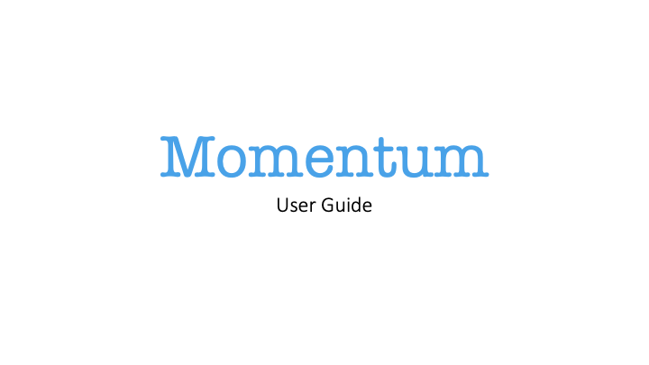

## Table of Contents

* Table of Contents
{:toc}

--------------------------------------------------------------------------------------------------------------------

## 1. Introduction

Attention all freelancers, here is an application you have always wanted, but never got to experience!

We freelancers are always busy managing multiple projects at once. On top of that, each project comes with its own tasks and deadlines. This list is endless, but sadly, our brain capacity is exhaustive.

As freelancers ourselves, we understand. We too have had times where we woke up feeling fresh, before realising (with a shiver down our spine) that we have completely forgotten about a certain project deadline. 

This is why we have developed an application for freelancers, and freelancers only. 

Leave it to Momentum to do the following for you:
* **Organisation of Projects**
    * View projects’  sub-tasks, deadline, description with just a few keystrokes.
    * Find any projects and task in Momentum with a single command.
    * Sort projects in different orders to your convenience at any time.

* **Project Management**
    * Set reminders to remind you of upcoming deadlines.

* **Time Management**
    * Keep track of how much time you have been spending on each project using our time-tracking tools.
    * Gain insights into your time usage with our statistics feature.

* **Personalisation**
    * Personalise Momentum’s settings to fit your preference.

We present you Momentum, the application that will make sure you never lose your momentum in your work ever again.

Momentum is a Command Line Interface (CLI) application equipped with Graphical User Interface (GUI) that is interactive, visually appealing, and easy to use. This means everything within our application can be done with just your keyboard, which provides a user-friendly experience for you. 

## 2. About this Document
This user guide provides detailed explanations and walkthroughs on the features available in Momentum. If you wish to learn how to use Momentum, this guide is for you. While reading this document, here are a few things you should take note of.

### 2.1. Notations Used
Throughout this document, you will come across these notations:

* **Clickable Links**: Words or phrases that are blue in colour are links which you can click on that will take you over to the section or page as described. For example, clicking on [this](#1-introduction) will take you back to the introduction of the user guide. 

* **Info Boxes**: These will display additional information that is good for you to know. There are two types of boxes, tip and warning boxes, and they are showed below:

  

  
  :bulb: These are tip boxes. They will provide you with useful tips.

  

  

  
  :warning: These are warning boxes. They will contain information of things that you should be careful of.

  

* **Keyboard Keys**: Words that are wrapped in a box like <kbd>this</kbd> points to a corresponding key on your keyboard.

* **Terminology**: Momentum tracks both your projects and tasks. In this document, if we are referring to both projects and tasks at the same time, we will use the term "item". 

### 2.2. Command Format

You will be presented with multiple commands throughout this document. You may find the description of the command format below.

* Words in `UPPER_CASE` are the parameters to be supplied by the user. Parameters are preceded by prefixes. The prefixes represent what the parameters will be used for in the command.
  e.g. in `add n/NAME`, `NAME` is a parameter which can be used as `add n/Blog Design`, whereas the `n/` signifies that the parameter is being used in the name.

* Items in square brackets are optional.
  e.g `n/NAME [t/TAG]` can be used as `n/Blog Design t/friend` or as `n/Blog Design`.

* Items with `…`​ after them can be used multiple times including zero times.
  e.g. `[t/TAG]…​` can be used as ` ` (i.e. 0 times), `t/friend`, `t/friend t/family` etc.

* Items with `…` inside square brackets `[t/TAG [MORE_TAGS]...]` can take in multiple space separated arguments
  e.g. `[[t/TAG [MORE_TAGS]...]` can represent `t/friend friend family`.

* Parameters can be in any order.
  e.g. If the command specifies `n/Blog Design dd/2020-11-05`, `dd/2020-11-05 n/Blog Design` is also acceptable.

#### 2.2.1. Index Format

* You need to enter an id which refers to the id number shown in the displayed list.

* You need to enter a **positive number** such as 1, 2, 3, …​

### 2.3. Date and Time Terms

This is a guide to the date and time formats used in Momentum.

#### 2.3.1. Date Terms

Dates should be entered in the order `YYYY-MM-DD`.

Term  | Meaning | Example
----- |-------- | -------
`YYYY`| Year    | `2020`
`MM`  | Month   | `02`
`DD`  | Day     | `09`

**Valid**: `2020-08-02`

**Invalid**: `2-8-20` Wrong number of digits.

**Invalid**: `02-08-20` Wrong order of year, month and date.

**Invalid**: `2nd August 2020` You cannot use text to enter dates.

#### 2.3.2. Time Terms

Times should be entered in 24 hour format, in the order `HH:MM:SS`.

Term | Meaning | Example
-----|-------- | -------
HH   | Hour    | `16`
MM   | Minute  | `52`
SS   | Second  | `03`

**Valid**: `15:08:02`

**Invalid**: `15:8:2` Wrong number of digits.

**Invalid**: `8:15:2` Wrong order of hour, minute and second.

**Invalid**: `03:08:02PM` Only 24 hour time is accepted.

#### 2.3.3. Combining Date and Time

You may also have to enter both dates and times together. When entered together, dates and times should be entered in the order `YYYY-MM-DDTHH:MM:SS`. The letter `T` separates the date and time.

**Valid**: `2020-08-02T15:08:02`

**Invalid**: `15:08:02T2020-08-02` Wrong order of date and time.

## 3. Quick Start

1. Ensure you have Java `11` or above installed in your computer.

2. Download the latest file from [here](https://github.com/AY2021S1-CS2103T-T10-1/tp/releases).

3. Copy the file to the folder you want to use as the _home folder_ for Momentum.

4. Double-click the file to start Momentum. The GUI similar to below should appear in a few seconds.

   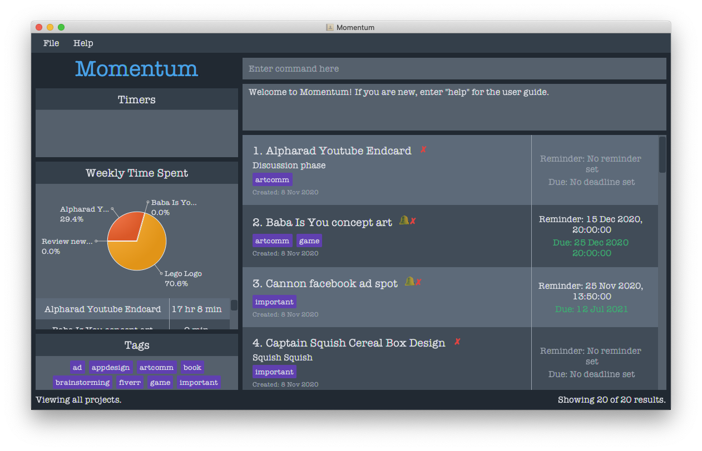
   Figure 3A: Momentum's User Interface

5. Type the command in the command box and press <kbd>Enter</kbd> to execute it. e.g. typing `help` and pressing <kbd>Enter</kbd> will open the help window. 

   Some example commands you can try:

   * `view 1` : View the tasks of project at index 1.

   * `home` : Go to home.

   * `add n/Momentum d/CS2103T Team Project` : Add a project named `Momentum` to the Project Book in project view. Add a task named `Momentum` to the project in task view.

   * `edit 3 n/NewMomentum d/newDescription` : Update the 3rd item in the current list. The name will be changed to `NewMomentum` and the description will be changed to `NewDescription`.

   * `delete 3` : Delete the 3rd item shown in the current list.

   * `find n/NewMomentum` : Find items that have `NewMomentum` in their name.

   * `list` : List all items based on the current view mode.

   * `sort type/deadline order/asc` : Sort the list of items by deadline in ascending order.

   * `start 1` : Start the timer of the item at index 1.

   * `stop 1` : Stop the timer of the item at index 1.

   * `exit` : Exit the app.

Refer to the [Features](#5-features) below for a more comprehensive set of features available in Momentum.

--------------------------------------------------------------------------------------------------------------------

## 4. User Interface Overview

Done by: Khoo De Hui

Momentum uses a graphical user interface (GUI) to interact with you. This is where you will give your input, and where Momentum will display information to you. This section will give you a walkthrough on the GUI of Momentum.

### 4.1. User Interface Components

The GUI is made up of multiple components, which is shown in Figure 4.1A below.

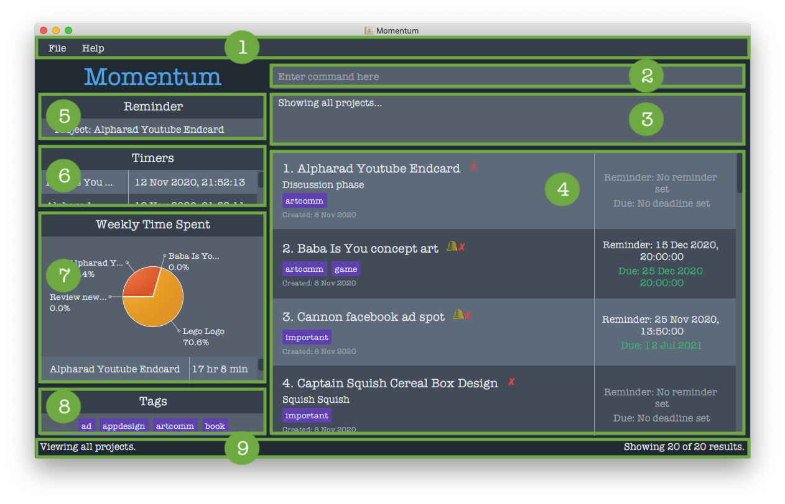
Figure 4.1A: GUI of Momentum with different components marked out.

With reference to the numbered labels in Figure 4.1A, these are the GUI components and their functions:

1. **Menu Bar**: The menu bar allows you to exit the application, or view this document. To exit the application, click on the `File` button and select `Exit`. To view this document, click on the `Help` button and select `User Guide`. A window containing the website address to this guide should appear.

2. **Command Box**: This is where you will enter in your commands. After typing your command, press <kbd>Enter</kbd> to execute them. If you enter an invalid command, your input will turn red.

3. **Result Box**: This is where Momentum will give you feedback on commands that you execute.

4. **Displayed List**: This is where a list of your items and all the information pertaining to them will be shown.

5. **Reminders Panel**: This is where your [reminders](#53-reminders) will appear. The panel will only show when you have reminders that have not yet been dismissed.

6. **Active Timers Panel**: This is where a list of all of your running [timers](#active-timers-panel) will be shown.

7. **Statistics Panel**: This is where a list of the [statistics](#56-statistics) of your time usage calculated by Momentum will be shown.

8. **Tags Panel**: This is where a collection of all the tags that are currently present in the displayed list will be shown.

9. **Bottom Bar**: Information about what you are currently viewing on the displayed list will be shown here. The left side of the bar tells you which project you are viewing, and the right side of the bar tells you how many items are present on the displayed list, out of the total number of items that you have.  

:bulb: The active timers, statistics and tags panels can be resized so that they can show more information. To do so, click and drag the edges dividing the panels upwards or downwards.

### 4.2. User Interface Theme

The GUI of Momentum also comes with two themes, Light and Dark. These themes are merely cosmetic and do not affect the application functionality in any way. The themes are shown below:

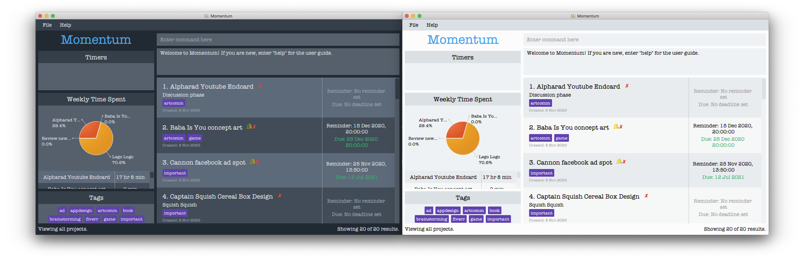

Figure 4.2A: Momentum GUI theme

By default, the theme of Momentum is set to Dark. If you want to adjust the theme, you can do so by changing it in the application [settings](#57-settings).

## 5. Features
### 5.1. Projects and Tasks

Done by: Farrell Nah Jun Hao

You can add projects into Momentum to be tracked. Each project can have the following information:

* Name
* Description
* Completion Status
* Deadline Date
* Deadline Time
* Reminder
* Tag

Apart from the name, all other information is optional.

Each project can also contain several tasks, each with the same information as a project.

When you first open Momentum, you will see all the projects being tracked in Momentum. You can then view the tasks for each project separately using the [view command](#511-viewing-a-projects-tasks-view)

**:bulb: Most commands in Momentum will do different things depending on whether you are viewing projects or tasks.** 

Please refer to each command for these differences.

#### 5.1.1. Viewing a Project's Tasks: `view`

Done by: Farrell Nah Jun Hao

View the tasks for a project.

Format: `view ID`

* You can refer to [Index Format](#221-index-format) for more information.

Example: `view 1`

The following walkthrough shows how you can use the view command to go from project view to task view.

Suppose you would like to view the tasks belonging to the 2nd project in the list.

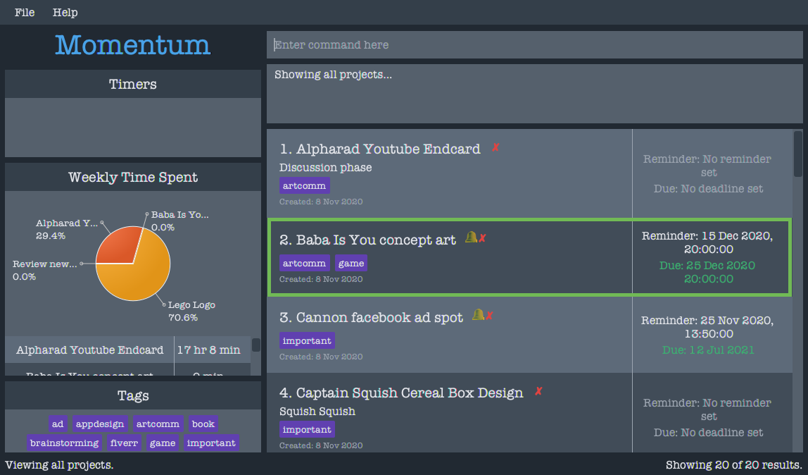

1. Type `view 1` into the command box and press <kbd>Enter</kbd>.

    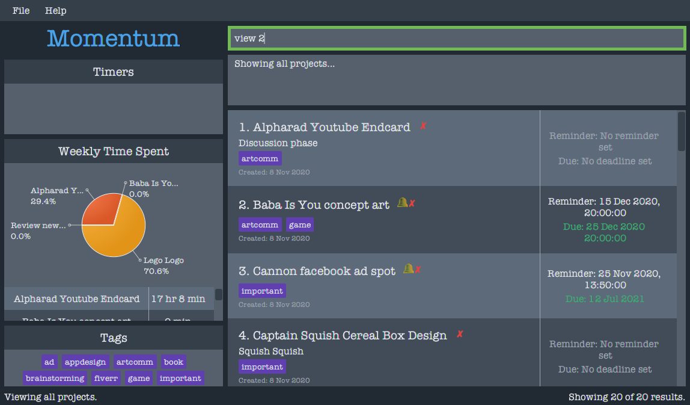

2. The results box will display a message to indicate that you have successfully changed your view.

    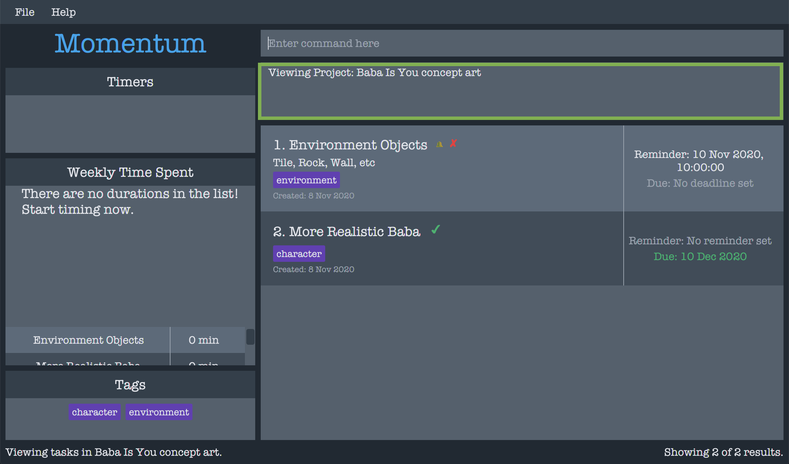
 
3. You should see the tasks belonging to the project in the displayed list.  

    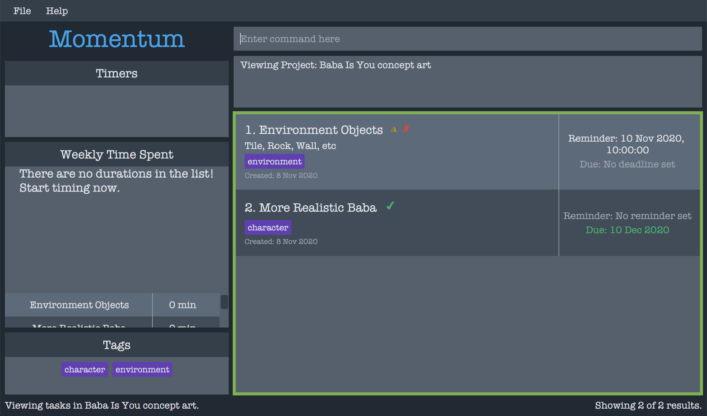

#### 5.1.2. Viewing Projects: `home`

Done by: Farrell Nah Jun Hao

View all the projects being tracked by Momentum.
This is the default view you will see when Momentum is first opened.

Format: `home`

The following walkthrough shows how you can use the home command to go from task view to project view.

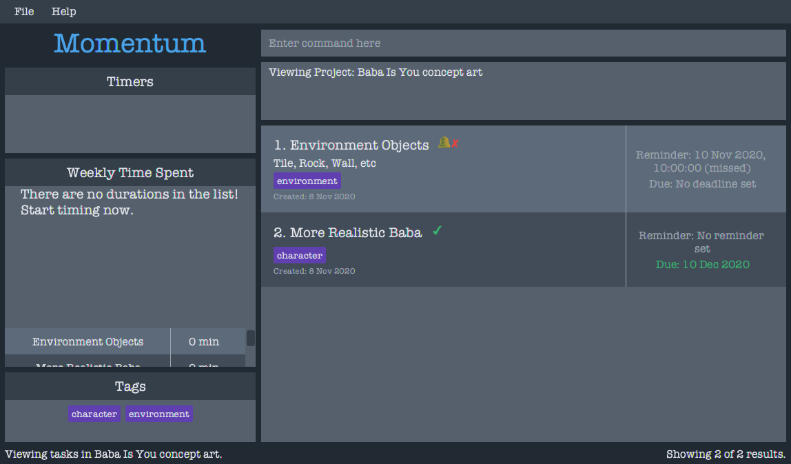

1. Type `home` into the command box and press <kbd>Enter</kbd>.

    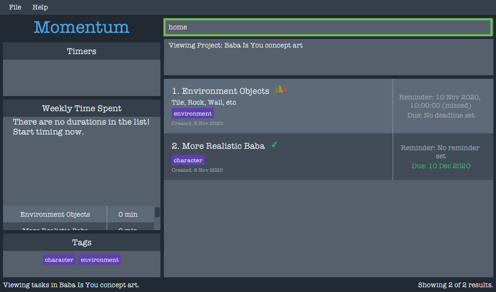

2. The results box will display a message to indicate that you have successfully changed your view.

    

3. You should see the tasks belonging to the project in the displayed list.

    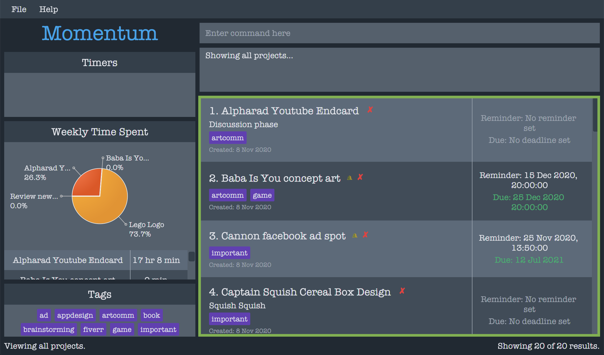

#### 5.1.3. Creating a Project/Task: `add`

Done by: Cheong Ying Yi Clara

When Momentum is in [project view](#7-glossary), you can use the add command to create a new project. When Momentum is in [task view](#7-glossary), you can use the add command to create a new task for the project that you are viewing.

Format: `add n/NAME [d/DESCRIPTION] [c/] [dd/DEADLINE_DATE [dt/DEADLINE_TIME]] [r/REMINDER_DATE_TIME] [t/TAG]`

* `n/NAME`

  * You can enter alphanumeric characters (a-Z, 0-9) and spaces for names.   

* `[d/DESCRIPTION]`

  * You can enter any character for descriptions.  

* `[c/]`

  * The item added will be incomplete by default.

  * You can add an item with completion status complete by entering `c/`.  

* `[dd/DEADLINE_DATE [dt/DEADLINE_TIME]]`

  * Note that `dt/DEADLINE_TIME` is an optional part of the the `dd/`. You cannot enter a deadline with time only.

  * You can enter a deadline with date only.

  * You need to enter the date of the deadline using YYYY-MM-DD format. (refer to [Date Terms](#231-date-terms) for more information on YYYY, MM and DD)

  * You need to enter the time of the deadline using HH:MM:SS format in 24 hours. (refer to [Time Terms](#232-time-terms) for more information on HH, MM and SS)

  

  :warning: You cannot enter a date earlier than the creation date of the item for deadlines.

  

* `[r/REMINDER_DATE_TIME]`

  * You need to enter both date and time for a reminder.

  * You need to enter date and time of the reminder using YYYY-MM-DDTHH:MM:SS format. (refer to [Date and Time Terms](#23-date-and-time-terms) for more information on YYYY, MM, DD, HH, MM, and SS)

  

  :warning: You cannot enter a date and time earlier than the current date and time for reminders (refer to [Reminders](#53-reminders) for more details).

  

* `[t/TAG]`

  * Similar to names, you can enter alphanumeric characters (a-Z, 0-9) and spaces in tags.
  
  * You can enter any number of tags, including 0.

The following walkthrough shows how you can create a new project in Momentum.

1. You can type `add n/Momentum d/CS2103T Team Project c/ dd/2021-12-07 dt/11:01:12 r/2021-12-07T11:01:12 t/impt` in the command box, and press the <kbd>Enter</kbd> key to execute it.

    

2. The result box will display a message to indicate that you executed the command successfully.

    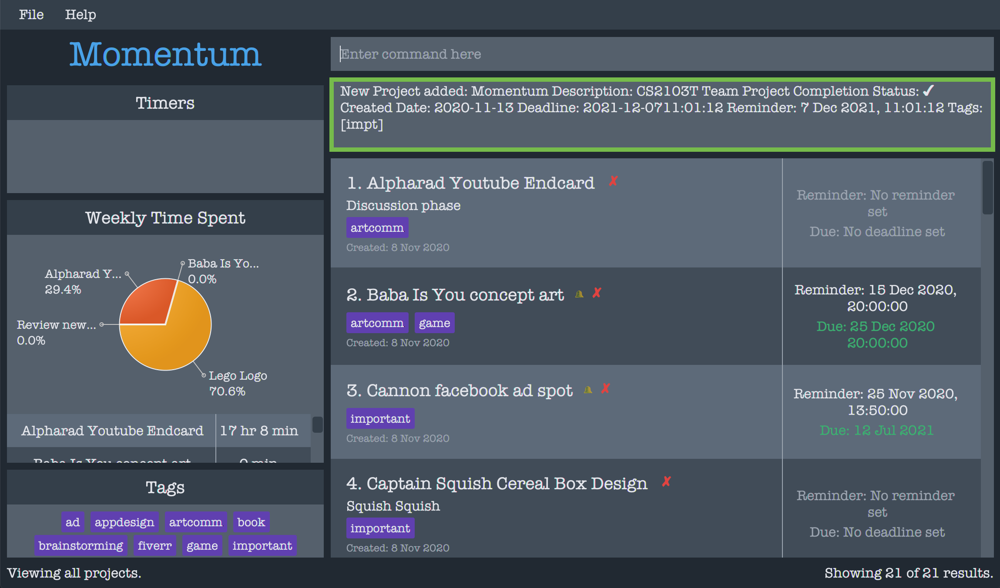

3. You added a project to the project list as shown below.

    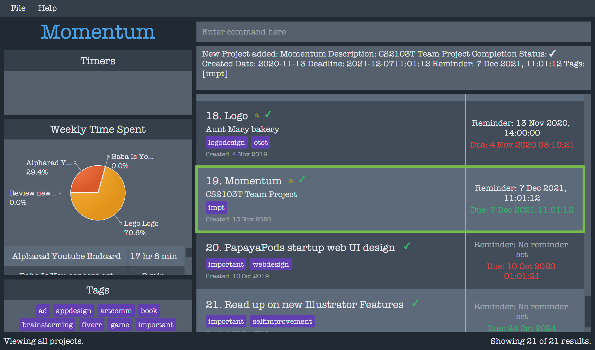

4. On 7 December 2021, at 11:01:12, the reminder panel will show the reminder you added and the reminder of the project will be removed.

    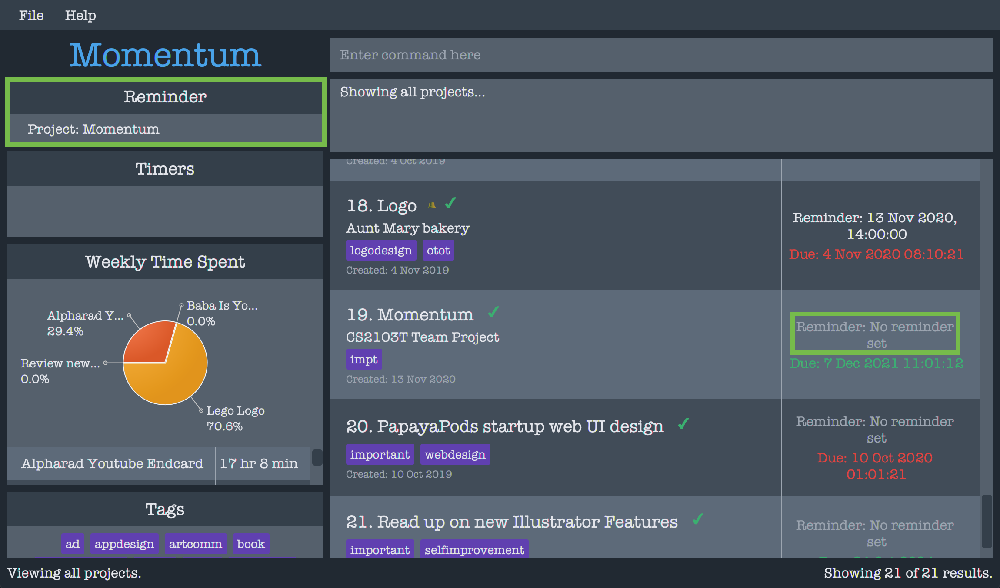

#### 5.1.4. Editing a Project/Task: `edit`

Done by Cheong Ying Yi Clara

When Momentum is in [project view](#7-glossary), you can use the edit command to edit a project. When Momentum is in [task view](#7-glossary), you can use the edit command to edit a task for the project that you are viewing.

Format: `edit ID [n/NAME] [d/DESCRIPTION] [c/] [dd/DEADLINE_DATE [dt/DEADLINE_TIME]] [r/REMINDER_DATE_TIME] [t/TAG]`

* You need to provide at least one of the optional fields.

* Your input will override the existing values of the item edited.

:bulb: You can remove a description, a deadline or a reminder by typing `d/` or `dd/` or `r/` without specifying anything after it.

* `ID`

  * You can refer to [Index Format](#221-index-format) for more information.   
  
* `n/NAME`

  * You can enter alphanumeric characters (a-Z, 0-9) and spaces for names.   

* `[d/DESCRIPTION]`

  * You can enter any character for descriptions.   

* `[c/]`

  * You can change the completion status of an item by entering `c/`.

  * If the item was incomplete, the completion status will change to complete.

* `[dd/DEADLINE_DATE [dt/DEADLINE_TIME]]`

  * Note that `dt/DEADLINE_TIME` is an optional part of the the `dd/`. You cannot enter a deadline with time only.

  * You can enter a deadline with date only.

  * You need to enter the date of the deadline using YYYY-MM-DD format. (refer to [Date Terms](#231-date-terms) for more information on YYYY, MM and DD)

  * You need to enter the time of the deadline using HH:MM:SS format in 24 hours. (refer to [Time Terms](#232-time-terms) for more information on HH, MM and SS)

* `[r/REMINDER_DATE_TIME]`

  * You need to enter both date and time for a reminder.

  * You need to enter date and time of the reminder using YYYY-MM-DDTHH:MM:SS format. (refer to [Date and Time Terms](#23-date-and-time-terms) for more information on YYYY, MM, DD, HH, MM, and SS)

* `[t/TAG]`

  * Similar to names, you can enter alphanumeric characters (a-Z, 0-9) and spaces in tags.

  * Momentum will replace all the existing tags of the item with the new tags that you added.

  

  :bulb: You can remove all the project’s tags by typing `t/` without specifying any tags after it.

  

The following walkthrough shows how you can edit a task in Momentum.

1. In task view, you can type `edit 3 n/NewMomentum d/NewDescription dd/2021-12-07 r/ t/normal` in the command box, and press the <kbd>Enter</kbd> key to execute it.

    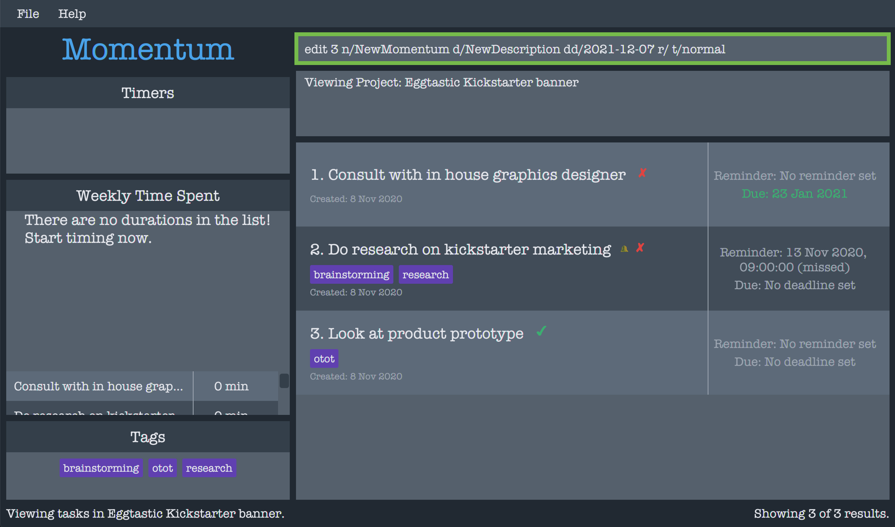

2. The result box will display a message to indicate that you executed the command successfully.

    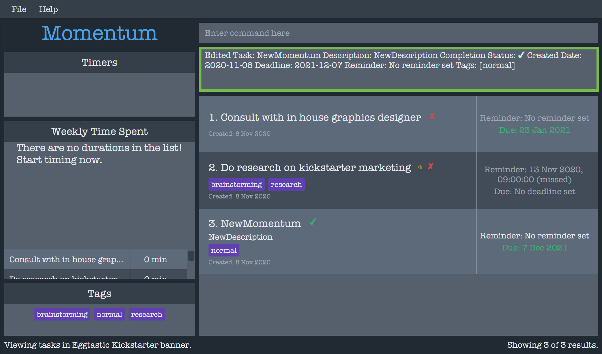

3. You have edited task 3 as shown below.

    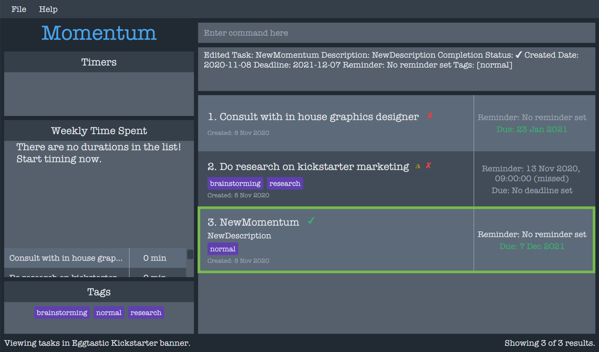

#### 5.1.5. Deleting a Project/Task: `delete`

Done by Farrell Nah Jun Hao

Deletes an item in the list.

Format: `delete ID`

* Deletes the item at the specified `ID`.
* You can refer to [Index Format](#221-index-format) for more information.

Example: `delete 2`

Result: Deletes the second item in the list.

The following walkthrough shows how you can delete a task in Momentum.

Suppose you would like to delete the first project in the list.

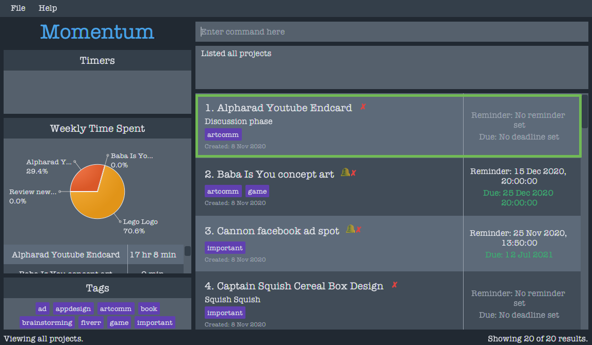

1. Type `delete 1` into the command box and press <kbd>Enter</kbd>.

    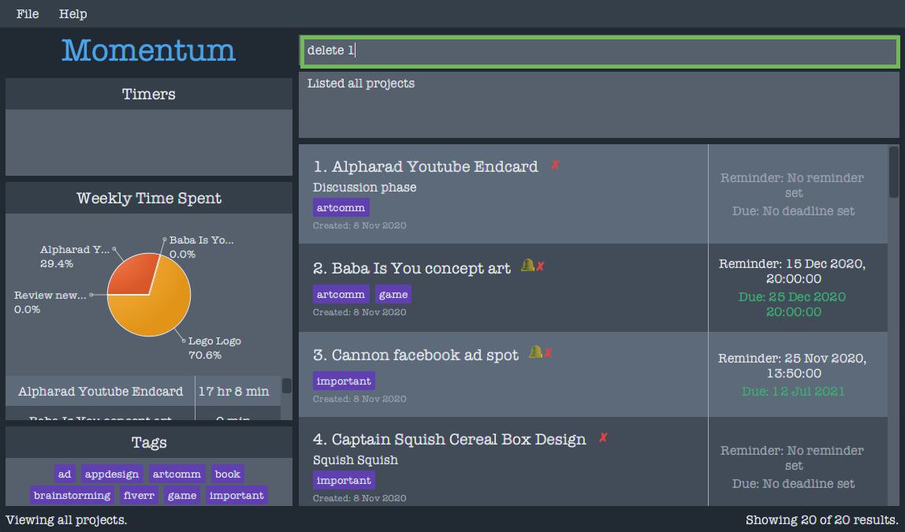
    
2. The results box will display a message to indicate that the project has been successfully deleted. You should no long see the project in the displayed list.

    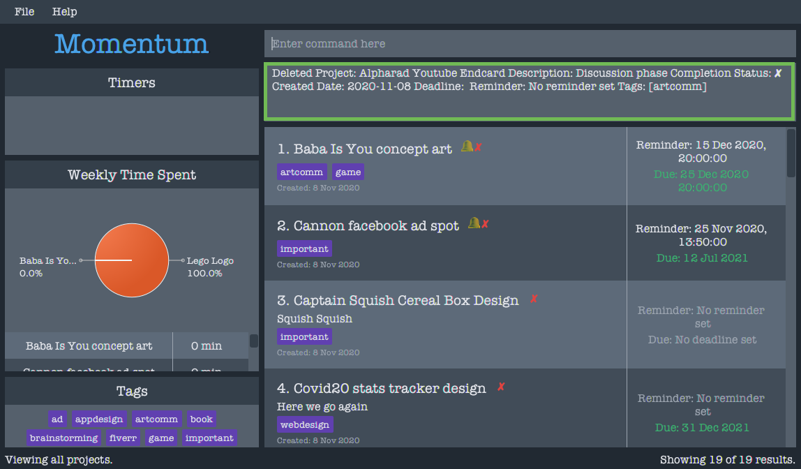

#### 5.1.6. Sorting Projects/Tasks : `sort`

Done by Kang Su Min

This command allows you to sort the list of displayed items in a particular sort type and order.

Format: `sort [type/SORT_TYPE] [order/SORT_ORDER] [c/]`

* There are 3 sort types.

  * `type/alpha` will sort the list of items in alphabetical order.
  
  * `type/deadline` will sort the list of items according to their deadlines.

  * `type/created` will sort the list of items according to their date of creation.

* There are 2 sort orders.

  * `order/asc` will sort the list of items in ascending order.

  * `order/dsc` will sort the list of items in descending order.

In addition to the above sort types and orders, the list can be sorted by completion status.

* This is the "dominant sort" that will ensure that all incomplete items are above complete items, before sorting the items in the specified sort type and order above.

* The default sort order will sort the items by completion status.

* `sort c/` will toggle the default completion status sort.

    * Once the completion status sort is `off`, the items will be sorted in the specified sort type and order without regard for their completion status.

:bulb: Here are some things you should take note of.

* When the application first starts, the completion status order is turned `on`. This completion status sort status (`on`/`off`) is maintained until it is toggled.

* `type/alpha` and `order/asc` will be used as default if both sort type and order are not specified. For example, when the command is `sort`.

* For both `sort type/deadline` and `sort type/created`, items with the same deadline or same created date will be sorted in alphabetical order.

* For `sort type/deadline`, items with deadlines will appear at the top of the list sorted in deadline order, while those without deadlines will be pushed to the end of the list sorted in alphabetical order.

##### 5.1.6a. Sorting by Default Order

Format: `sort`

This sorts items in default ascending alphabetical order.

The following walkthrough shows how you can sort projects in Momentum by the default order.

1. Key in command `sort` in the command box and press <kbd>Enter</kbd>.

    

2. The result box will display a message to indicate that the command has been executed successfully.

    

3. All projects are ordered in default ascending alphabetical order with incomplete tasks showing up at the top of the list (completion status order is `on`).

    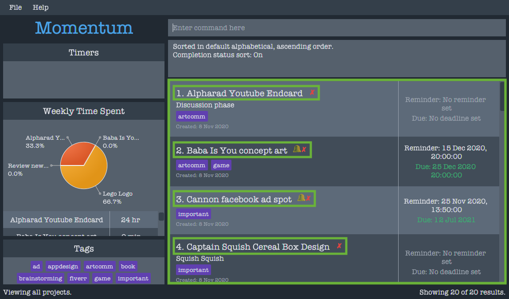

##### 5.1.6b. Sorting with Completion Status Toggle

Format: `sort c/`

This toggles the completion status order. For example, if the completion status order is `on`, it will be turned `off`, vice versa.

The following walkthrough shows how you can toggle the completion status order in Momentum.

1. Key in command `sort c/` in the command box and press <kbd>Enter</kbd>.

    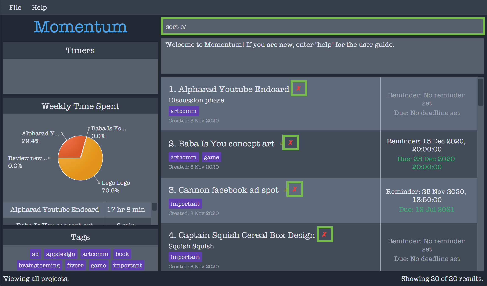

    Note that currently all projects at the top of the list are incomplete tasks.

2. The result box will display a message to indicate that the command has been executed successfully.

    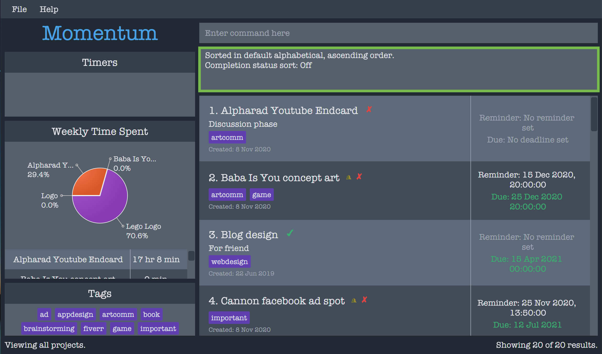

3. All projects are ordered in default ascending alphabetical order without regard for their completion status.

    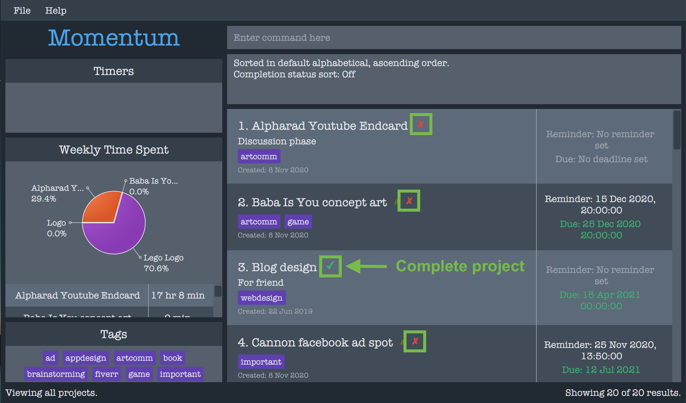

##### 5.1.6c. Sorting with Only Type Specified

If you do not specify the sorting order, Momentum will assume that you would like to sort in ascending order.

Format: `sort type/SORT_TYPE`

Example: `sort type/deadline`

The following walkthrough shows how you can sort projects in Momentum by specifying only the sort type.

1. Key in command `sort type/deadline` in the command box and press <kbd>Enter</kbd>.

    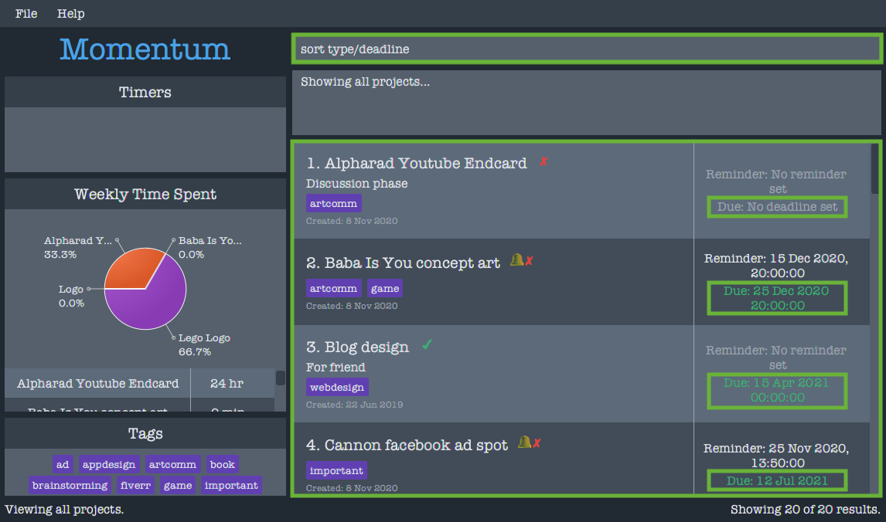

    Note that the projects are not sorted in ascending deadline order.

2. The result box will display a message to indicate that the command has been executed successfully.

    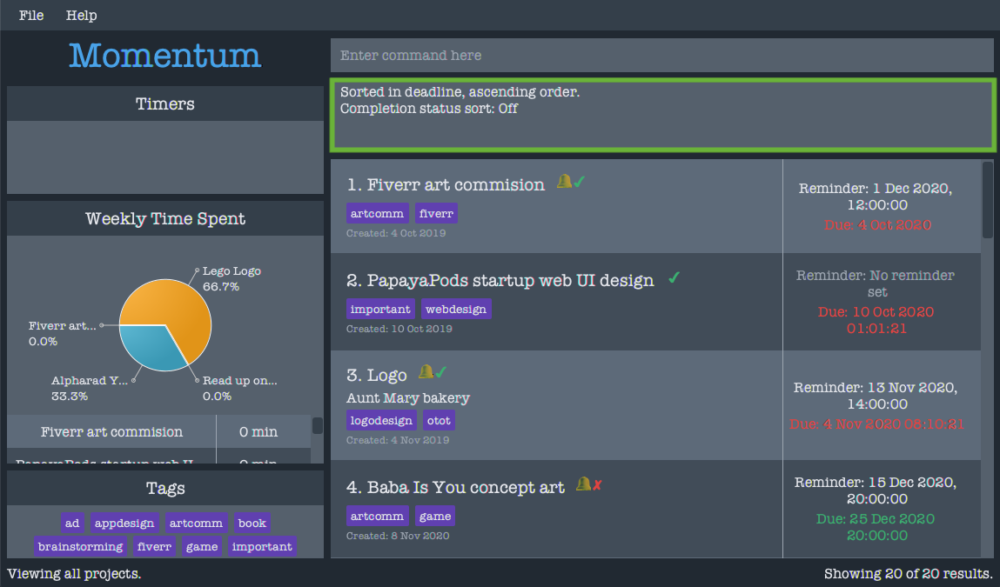

3. All projects are ordered in ascending deadline order.

    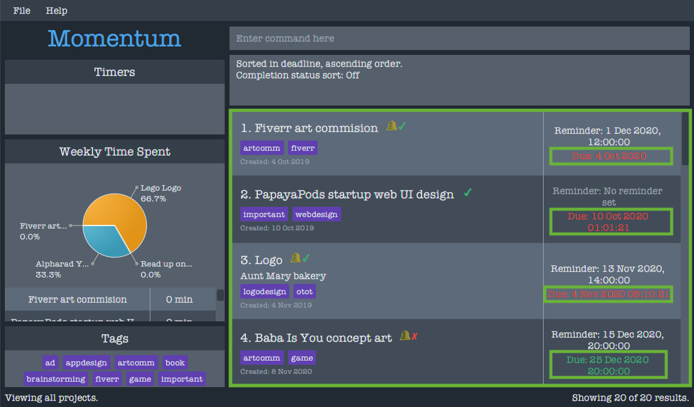

##### 5.1.6d. Sorting with Only Order Specified

The current sort type will be used if the `type` is not specified.

If there is no existing project order (when the application restarts), order will be alphabetical by default.

Format: `sort order/SORT_ORDER`

Example: `sort order/dsc`

The following walkthrough shows how you can sort projects in Momentum by specifying only the sort order.

1. Key in command `sort order/dsc` in the command box and press <kbd>Enter</kbd>.

    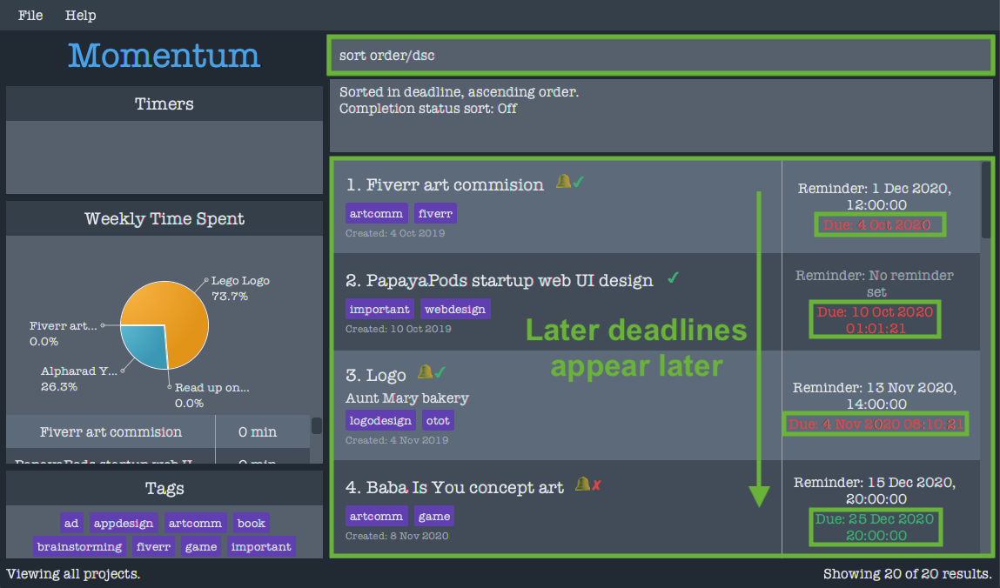

    Note that currently the projects are sorted in ascending deadline order.

2. The result box will display a message to indicate that the command has been executed successfully.

    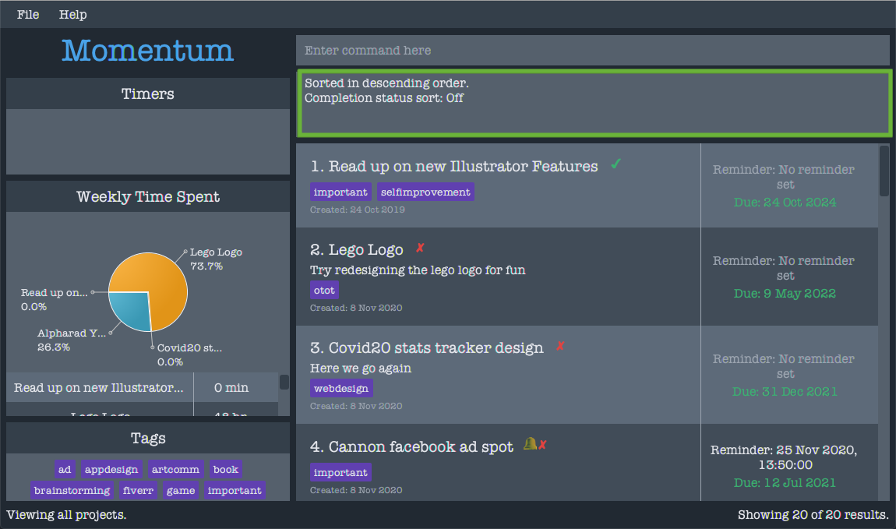

3. All projects are ordered in descending deadline order.

    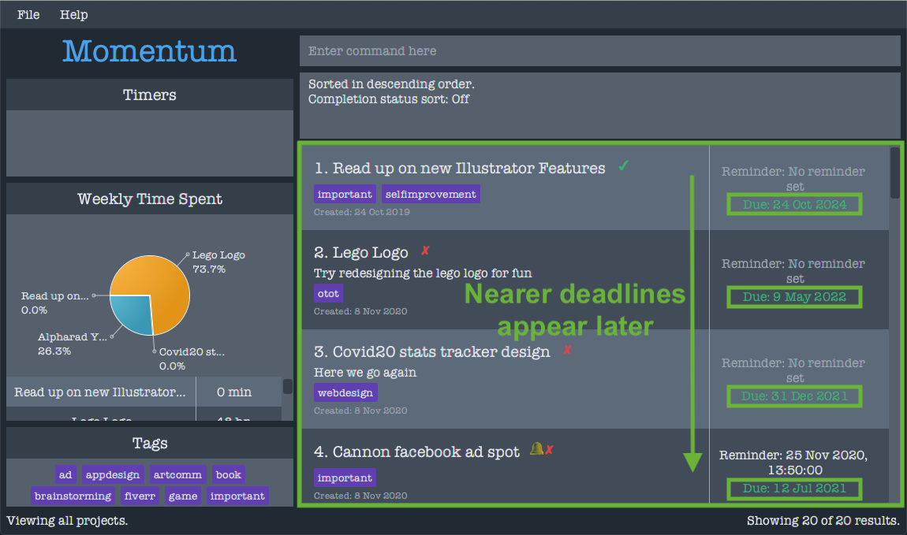

##### 5.1.6e. Sorting With Both Type and Order Specified

This sorts items in the specified type and order.

Example: `sort type/created order/dsc`

The following walkthrough shows how you can sort projects in Momentum by specifying both sort type and order.

1. Key in command `sort type/created order/dsc` in the command box and press <kbd>Enter</kbd>.

    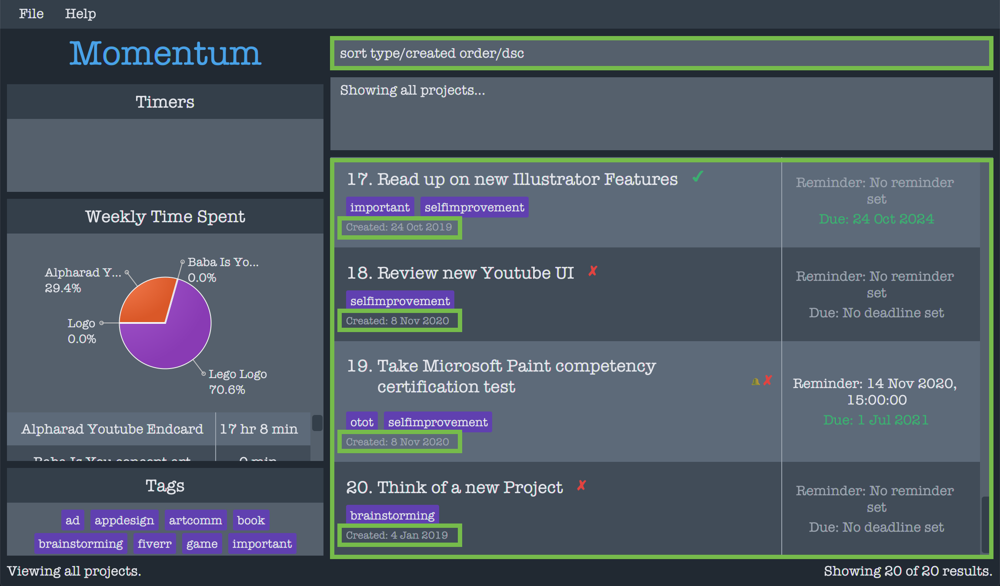

    Note that the projects are not sorted by descending created date order.

2. The result box will display a message to indicate that the command has been executed successfully.

    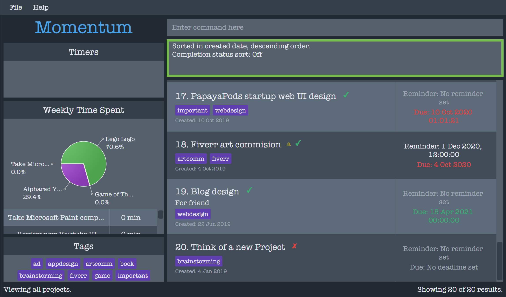

3. All projects are ordered in descending created date order.

    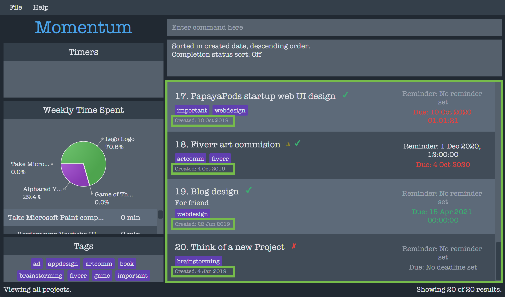

    Note that for projects with the same created date, they are sorted in descending alphabetical order.

#### 5.1.7. Searching for Projects/Tasks: `find`

Done by Balasubramaniam Praveen

Momentum allows you to make detailed searches for items based on a combination of their name, description, tags and completion status. This is done using the find command.

Format: `find [match/FILTER_TYPE] [n/NAME [MORE_NAMES]...] [d/DESCRIPTION [MORE_DESCRIPTIONS]...] [t/TAG [MORE_TAGS]...] [c/COMPLETION_STATUS]`

Here are some ways you can make simple searches using the find command. Advanced searches will be [discussed later](#517e-searching-by-multiple-parameters). 

:bulb: You can only search for projects in the project view and tasks in the tasks view.

:bulb: Search parameters are not case sensitive.

##### 5.1.7a. Searching by Name

* The `n/` prefix checks whether an item has a certain name.

* Searching by name only requires a partial match. This means that an item with the name `carpet` and `car` can potentially be the result of searching for the term `car`.

The following walkthrough shows how you can use the find command to search for items with `ad` in their name.

1. Key in the command `find n/ad` in the command box and press <kbd>Enter</kbd>.

    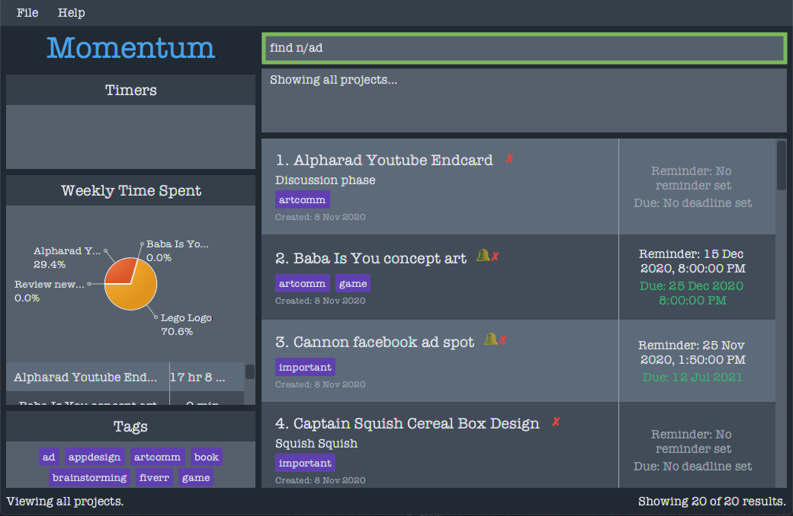

2. The result box will display a message to indicate that the command has been executed successfully.

    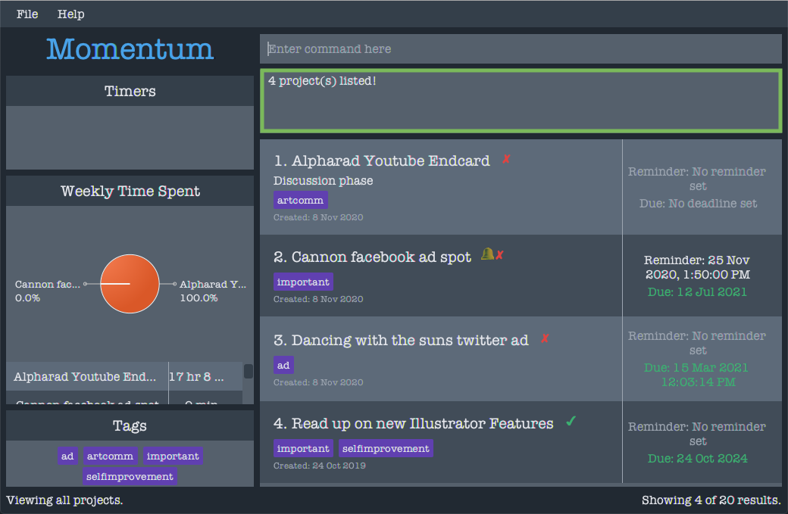

3. All projects that contain `ad` in their name will be shown.

    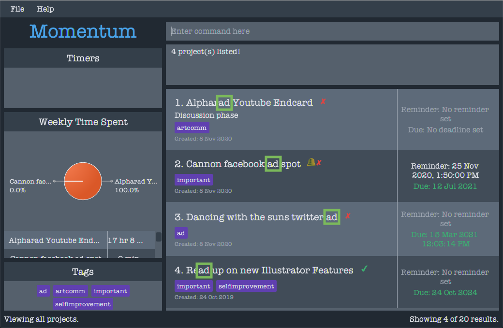

##### 5.1.7b. Searching by Description

* The `d/` prefix checks whether an item has a certain description.

* Searching by description only requires a partial match, similar to searching by name.

The following walkthrough shows how you can use the find command to search for items with `discussion` in their description.

1. Key in the command `find d/discussion` in the command box and press <kbd>Enter</kbd>.

    

2. The result box will display a message to indicate that the command has been executed successfully.

    

3. All projects that contain `discussion` in their description will be shown.

    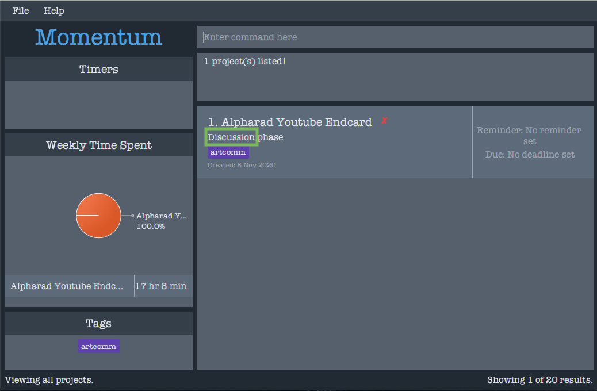

##### 5.1.7c. Searching by Tag

* The `t/` prefix checks whether an item has a certain tag.

* Searching by tags will require a full word match unlike searching by name or description. This means that searching for the tag `free` will not find an item with the tag `freelance`.

:bulb: Searches for tags require a full match whilst partial matches are sufficient for searches by name and description.

The following walkthrough shows how you can use the find command to search for projects with the tag `webdesign`.

1. Key in the command `find t/webdesign` in the command box and press <kbd>Enter</kbd>.

    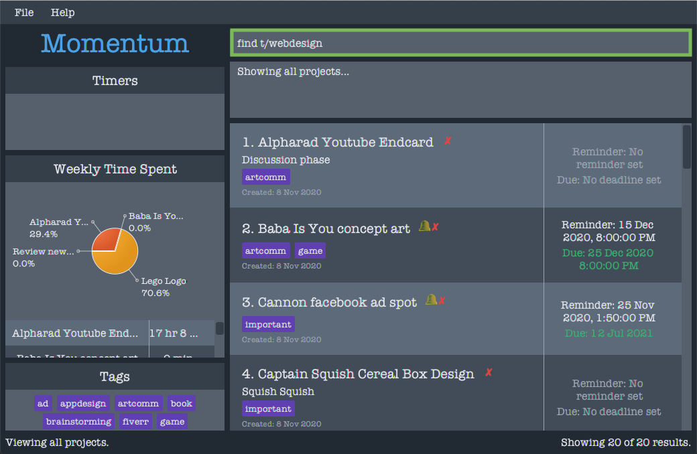

2. The result box will display a message to indicate that the command has been executed successfully.

    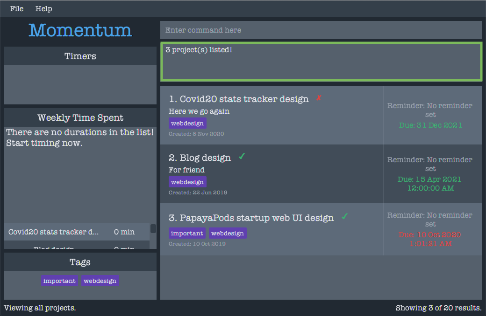

3. All projects that contain the tag `webdesign` will be shown.

    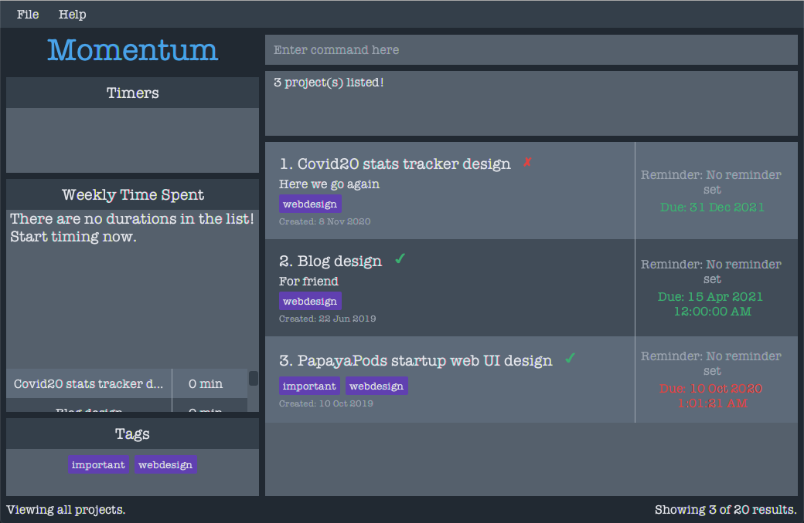

##### 5.1.7d. Searching by Completion Status

* Only the parameters `completed` and `incomplete` are accepted for `c/KEYWORD`.

* The `c/` prefix checks whether an item is completed. For example, `c/completed` will check for the items that are completed.

* When `c/` is not specified, both complete and incomplete items will be shown.

The following walkthrough shows how you can use the find command to search for projects that have been completed.

1. Key in the command `find c/completed` in the command box and press <kbd>Enter</kbd>.

    

2. The result box will display a message to indicate that the command has been executed successfully.

    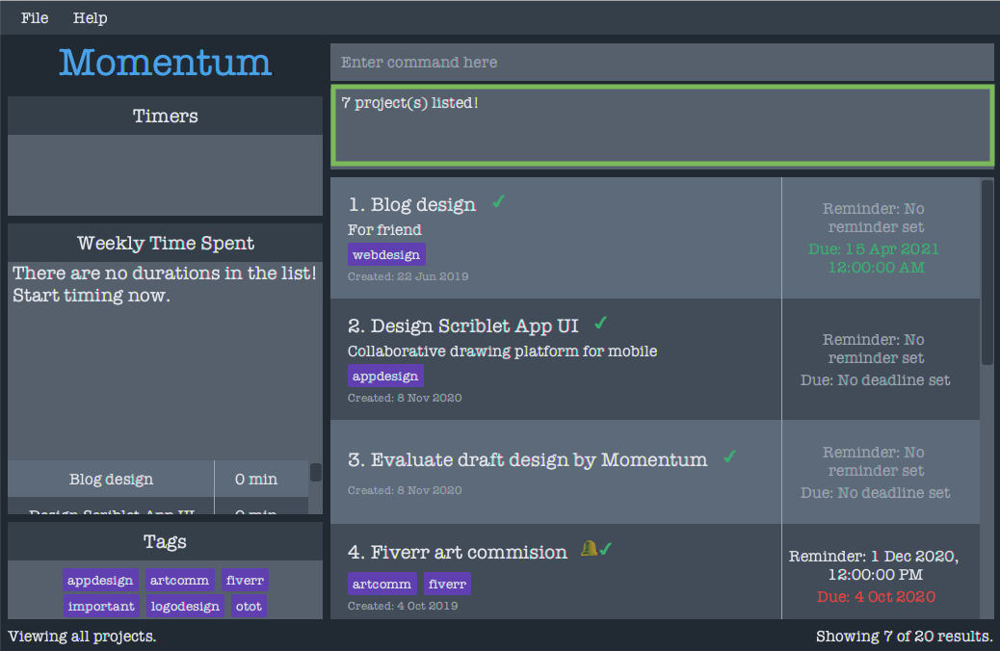

3. All projects that are completed will be shown.

    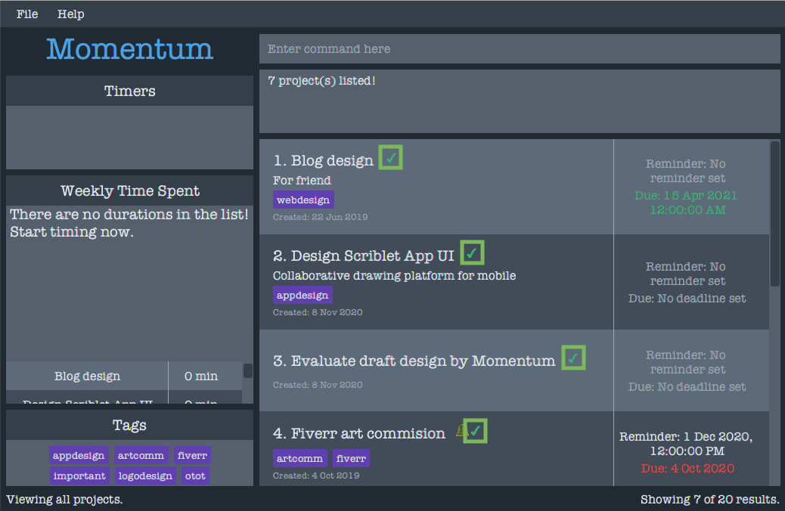

##### 5.1.7e. Searching by Multiple Parameters

You can search for items with multiple parameters for names, descriptions and tags in a single search.

To do this, you can add all the parameters that you would like to search for in the command. For example, if you would like to search for items that contain either `discussion` or `drawing` in their description, you can do so by searching using the command `find d/discussion drawing`.

In this command, each parameter to search for is separated by a whitespace.

The following walkthrough shows you can use the find command to search for projects with `discussion` or `drawing` in their description.

1. Key in the command `find d/discussion drawing` in the command box and press <kbd>Enter</kbd>.

    

2. The result box will display a message to indicate that the command has been executed successfully.

    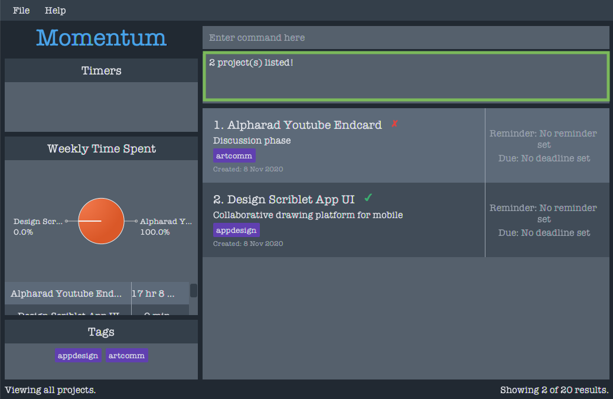

3. All projects that contain `discussion` or `drawing` in their description will be shown.

    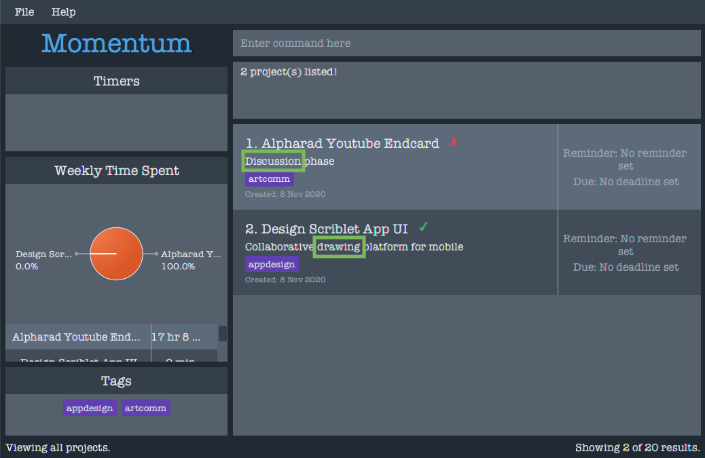

You can use the same method to search for projects using multiple parameters for name or tags. However, this will not work with completion status. You can only search by one completion status. 

##### 5.1.7f. Searching by Multiple Prefixes

So far, you have learnt how to search for items that contain multiple parameters for a single prefix. But what if you want to search for items by multiple prefixes instead? 

Momentum makes it extremely easy for you to do that. 

To make such a search, all you need to do is add all the prefixes you would like to search for in a single find command. You can think of this as combining multiple find commands together. For example, if you would like to search for items that contain either `certification` in their name or `discussion` in their description, you can do so by searching using the command `find n/certification d/discussion`.

The following walkthrough shows you can use the find command to search for projects that contain either `certification` in their name or `discussion` in their description.

1. Key in the command `find n/certification d/discussion` in the command box and press <kbd>Enter</kbd>.

    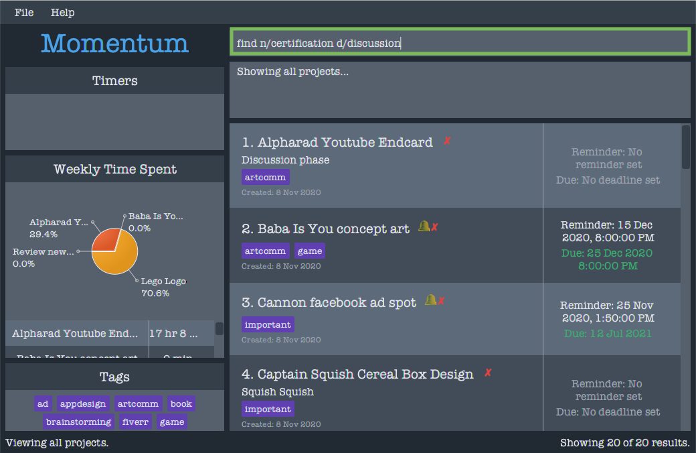

2. The result box will display a message to indicate that the command has been executed successfully.

    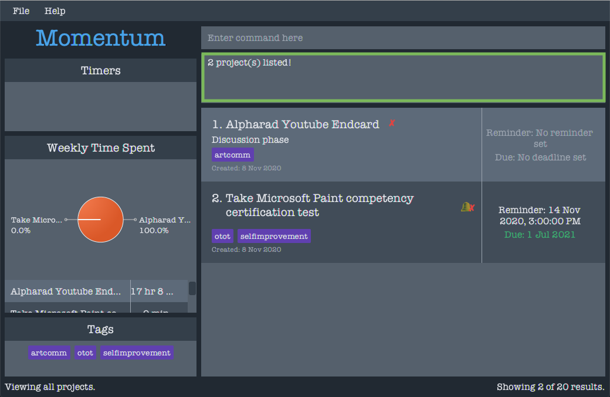

3. All projects that contain `certification` in their name or `discussion` in their description will be shown.

    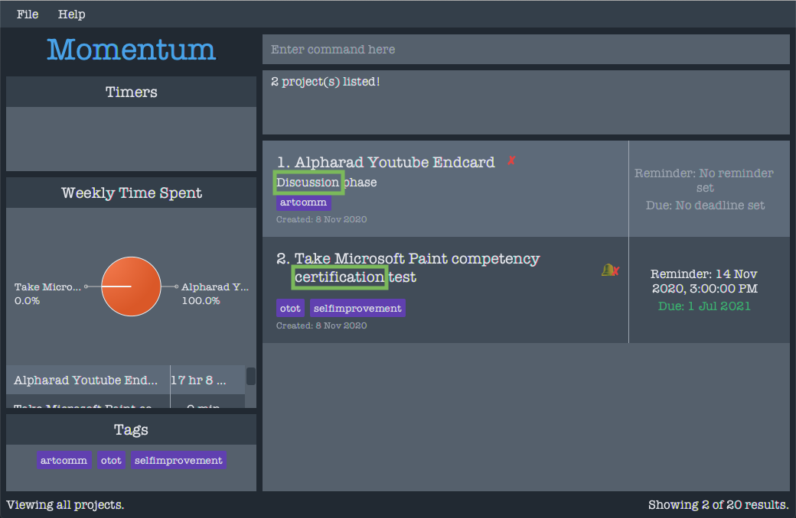

You can also use multiple parameters for each prefix that allows for it as mentioned in the previous section. 

:bulb: If a certain search prefix is used more than once, the last entry will be used.
`find n/a n/b n/c` will only search for items that contain`c` in their name.

##### 5.1.7g. Adding Match Type to Searches

So far, you have learnt how to make searches by multiple parameters and prefixes. However, the searches shown so far show an item as long as there is any one parameter that matches it. But this might not be useful in some cases. What if you need to search for an item that matches all parameters, or does not match any of the parameters entered.

This is where match type comes in. Match type can be added to your find command in addition to the prefixes and parameters you are searching by. 

There are three values for the `match/` prefix.
  * `match/all` shows an item only if **all** of the parameters and prefixes provided in your input matches the item.

  * `match/any` shows an item as long as **any** of the parameters and prefixes provided in your input matches the item.

  * `match/none` shows an item only if **none** of the parameters and prefixes provided in your input matches the item.

:bulb: **Tip:**
`match/any` will be used if the `match` type is not specified.

Here is an example to illustrate this concept more clearly. Consider the following command `find n/ad d/discussion t/artcomm`. We will compare how different match types affect the results displayed for the same command.

Let's first look at `match/any`. This match type shows an item as long as any parameter matches your input. It is also the default behaviour of the find command. The following walkthrough shows how to use `match/any`. 

1. Key in the command `find n/ad d/discussion t/artcomm match/any` in the command box and press <kbd>Enter</kbd>.

    

2. The result box will display a message to indicate that the command has been executed successfully.

    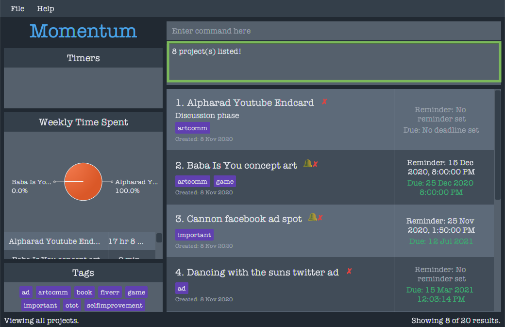

3. All projects that contain `ad` in their name or `discussion` in their description or the tag `artcomm` will be shown.

   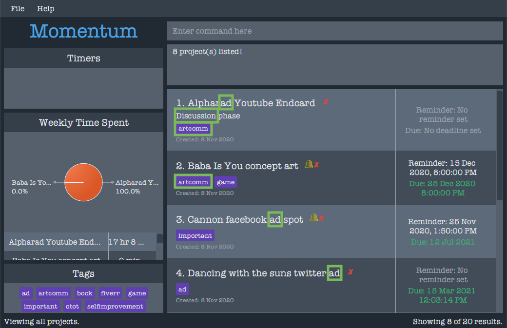

As seen in the example above, an item is shown as long as any one of the parameters matches it. 

Let's now look at `match/all`. This match type shows an entry only if all parameters matches your input. The following walkthrough shows how to use `match/all`. 

1. Key in the command `find n/ad d/discussion t/artcomm match/all` in the command box and press <kbd>Enter</kbd>.

    

2. The result box will display a message to indicate that the command has been executed successfully.

    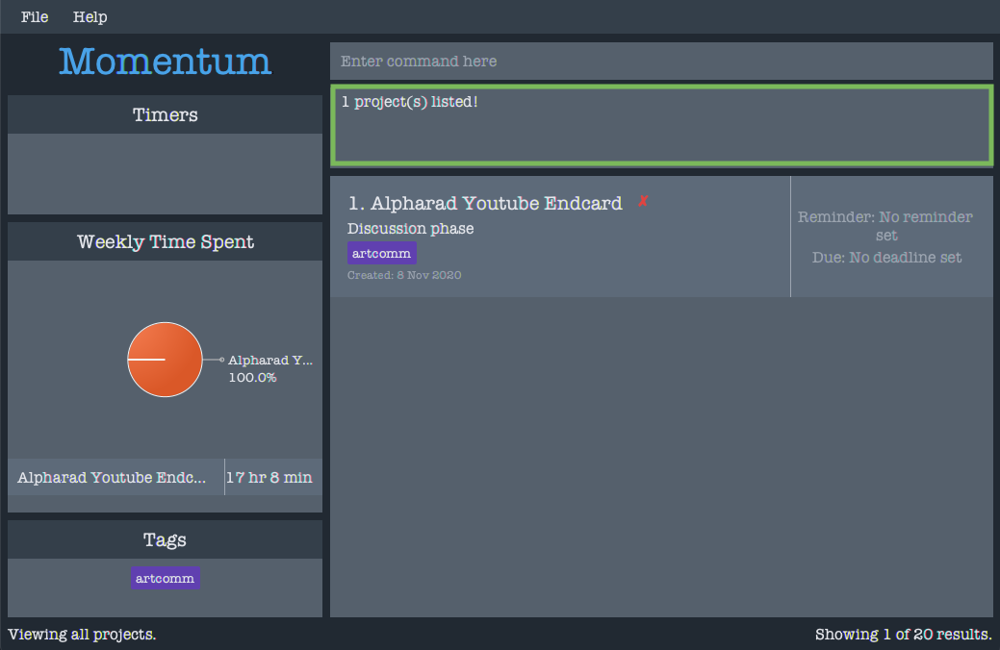

3. All projects that contain `ad` in their name and `discussion` in their description and the tag `artcomm` will be shown.

    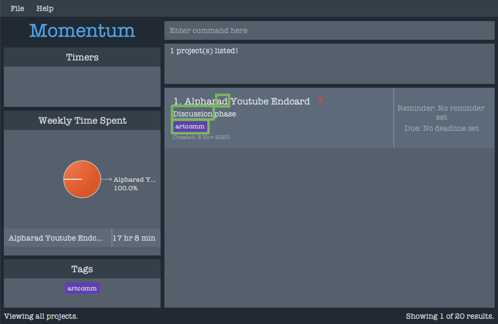

As seen in the example above, an item is only shown if all parameters matches it. 

Finally, let's look at `match/none`. This match type shows an item only if none of the parameters matches your input. The following walkthrough shows how to use `match/none`. 

1. Key in the command `find n/ad d/discussion t/artcomm match/none` in the command box and press <kbd>Enter</kbd>.

   

2. The result box will display a message to indicate that the command has been executed successfully.

   

3. All projects that do not contain `ad` in their name, `discussion` in their description and the tag `artcomm` will be shown.

   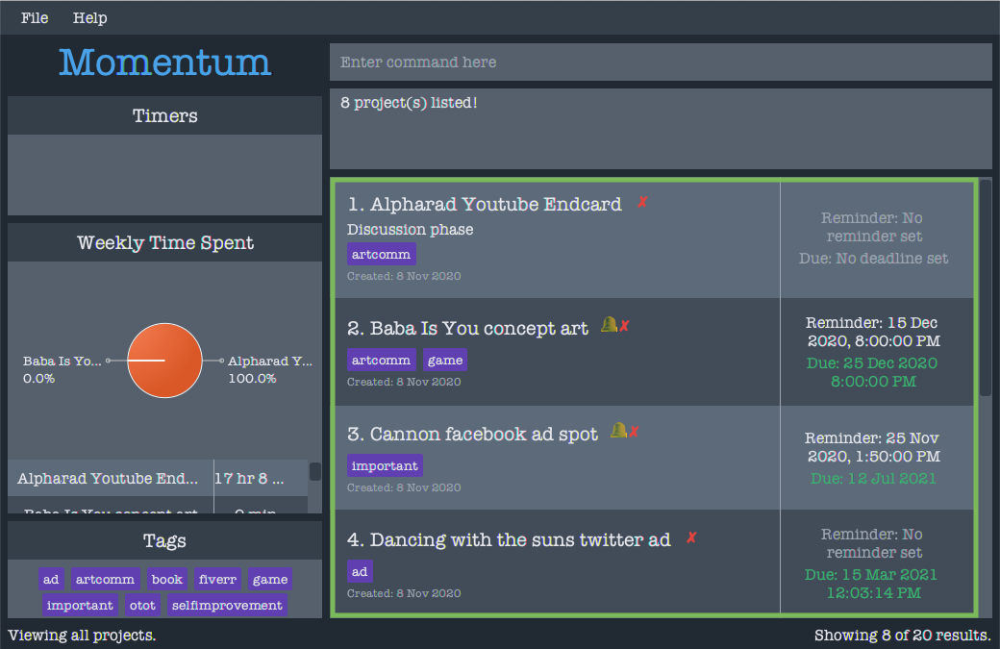

As seen in the example above, an item is only shown if none of the parameters matches it.

The possibilities of using match type to enhance your searches are limitless. Here are some examples where `match/all
` and `match/none` may come in handy.

1. If you have many items and want to find a specific one, you can use `match/all` to narrow down your search results.

2. If you have many items and want to find those that are not part of a certain category, you can use `match/none` to narrow down your search results.

#### 5.1.8. Viewing All Projects/Tasks: `list`

Done by Farrell Nah Jun Hao

When you are viewing projects, this command shows you a list of all projects in Momentum.

When you are viewing a project's tasks, this command shows you a list of all the tasks for the project.

:bulb:
Note that this command is different from the `home` command. When viewing a project's tasks, the `home` command will change the view to show you all the projects being tracked by Momentum. However, the `list` command will only show you all the tasks for the project.

Format: `list`

The following walkthrough shows how you can list projects in Momentum.

Suppose you had previously executed a [find command](#517-searching-for-projectstasks-find) and would like to see all your projects again.

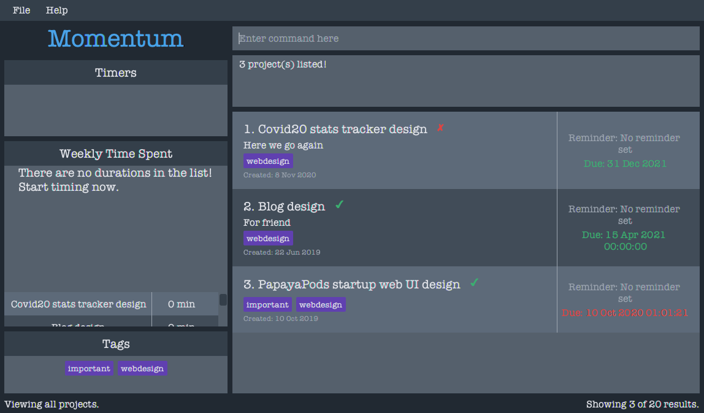

1. Type `list` into the command box and press <kbd>Enter</kbd>.

    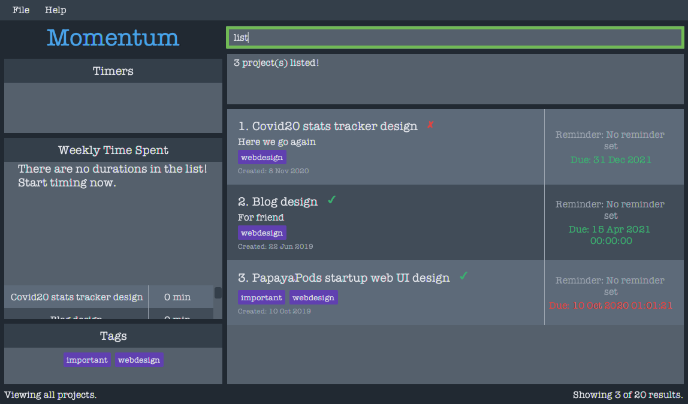
    
2. The results box will display a message to indicate that all your projects are being displayed. 

    

3. You should see that all your projects are being displayed in the displayed list.

    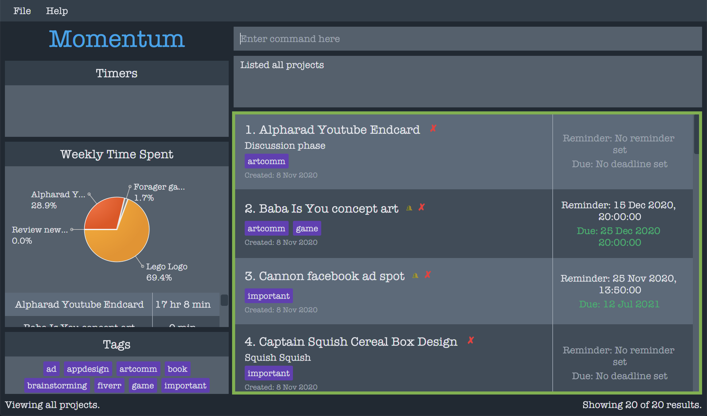

### 5.2. Time Tracking

Done by Farrell Nah Jun Hao

You can track the time you spend working on a project or task by starting a timer when you start working, and then stopping the timer once you finish.

Momentum remembers each timer that you start/stop and uses this information to calculate statistics.

#### 5.2.1. Starting a Timer: `start`

Format: `start ID`

* Starts a timer for the item at the specified `ID`.

* Only 1 timer can be running for each item at any time.

* You can refer to [Index Format](#221-index-format) for more information.

:bulb:
You can run timers for more than one item concurrently, if you are multi-tasking.

:bulb:
You can run timers for a project separately from its tasks. This allows you to track the time you spent on the project as a whole, as well as the time spent on each individual task.

Example: `start 2`

Result: Starts a timer for the second item in the displayed list.

#### 5.2.2. Stopping a Timer: `stop`

Format: `stop ID`

* Stops a running timer for the item at the specified `ID`.

* A timer can only be stopped if there is one already running.

* You can refer to [Index Format](#221-index-format) for more information.

Example: `stop 2`

Result: Stops the timer for the second item in the displayed list.

#### 5.2.3. Active Timers Panel

On the left side of the window is the Active Timers Panel. This is where Momentum shows you all the timers that are currently running.

Figure 5.2.3A: Location of the Active Timers Panel.

This panel will show you the name of the item, as well as when the timer was started.

The following walkthrough shows how you can use the `start` and `stop` commands to track the time that you spend on a project.

Suppose that you are going to start working on the project `Alpharad Youtube Endcard`, which is the first item shown below:

You can perform time tracking with the following steps:

1. To start the timer, type `start 1` into the command box and press <kbd>Enter</kbd>.

    

2. You should see the following message in the result box, indicating that the timer has been successfully started.

    

3. You should also see the project's name and start time in the active timers panel:

    

   Now that the timer has been successfully started, you can proceed to do your work. You can also choose to close Momentum. The timer will continue to run even when Momentum is closed. Proceed to the next step when you are done with your work.

4. To stop the timer, type `stop 1` into the command box and press <kbd>Enter</kbd>.

    

5. You should see the following message in the result box, indicating that the timer has been successfully stopped.

    

6. You should also see that the project has been removed from the active timers panel.

    

7. The [statistics panel](#56-statistics) will also be updated to reflect the time that you have spent working on the project.

    

### 5.3. Reminders

Done by Cheong Ying Yi Clara

* A reminder will be shown in the reminder panel of the sidebar at the date and time you specified.

* Momentum will remove the reminder in the item after it is shown in the sidebar.

* If you missed a reminder, it will be greyed out in the item.

* You can refer to [Creating a Project/Task](#513-creating-a-projecttask-add) for more details on how you can add a reminder.

#### 5.3.1. Dismissing a Reminder : `dismiss`

Done by Cheong Ying Yi Clara

You can dismiss a reminder using this command.

Format: `dismiss`

Result: The reminder panel of the sidebar will be hidden.

:warning: You cannot dismiss a reminder if the reminder panel of the sidebar is not visible.

The following walkthrough shows how you can dismiss a reminder.

This walkthrough is a followup of the walkthrough in [Creating a Project/Task](#513-creating-a-projecttask-add).

1. After the reminder panel is shown, you can type `dismiss` in the command box, and press the <kbd>Enter</kbd> key to execute it.

   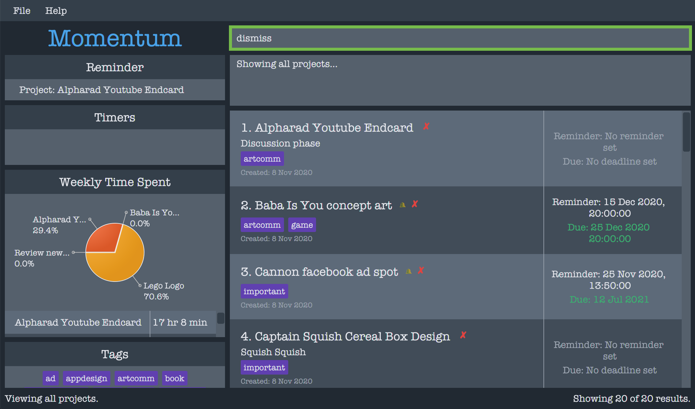

2. The result box will display a message to indicate that that you executed the command successfully.

   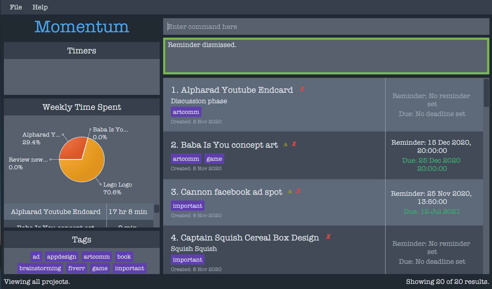

3. The reminder has been dismissed.

   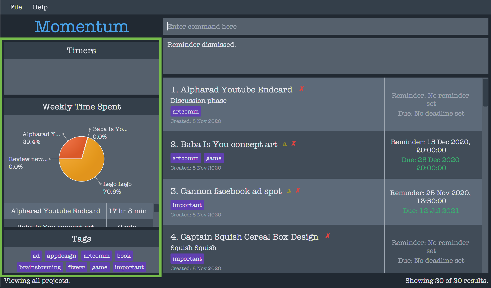

### 5.4. Showing and Hiding Tags : `show`

Done by Cheong Ying Yi Clara

You can hide or show the tags panel of the sidebar.

Format: `show t/`

Result: The visibility of the tags panel will be toggled.

:bulb: You can resize the tags panel by clicking and dragging the edges.

The following walkthrough shows how you can hide the tags panel.

1. You can type `show t/` in the command box, and press the <kbd>Enter</kbd> key to execute it.

   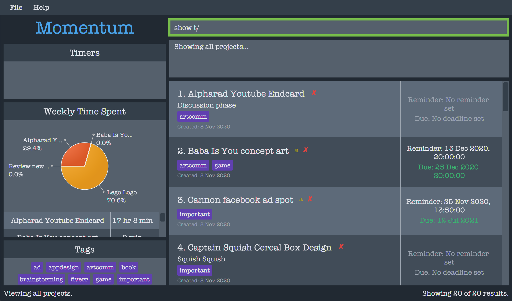

2. The result box will display a message to indicate that you executed the command successfully.

   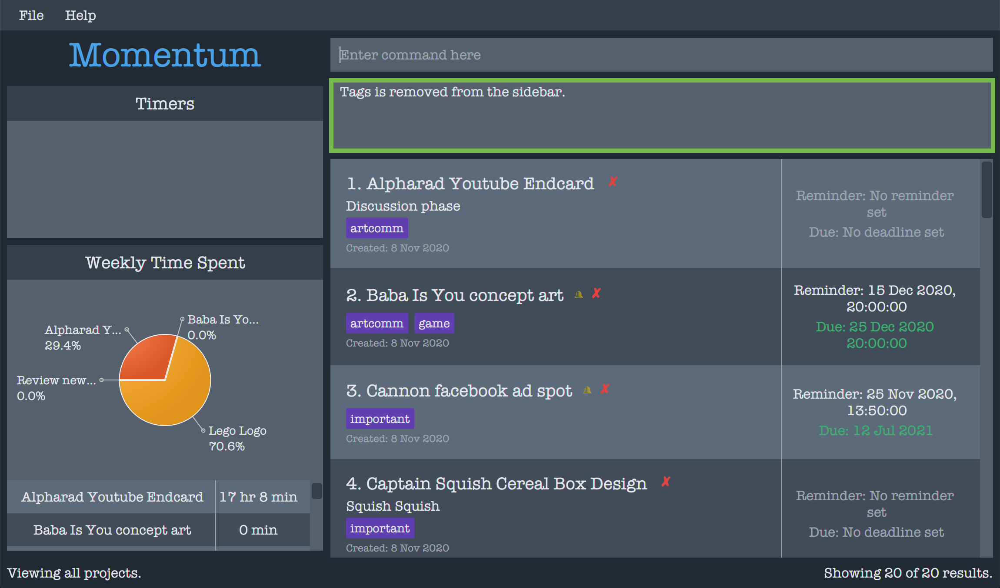

1. The tags panel has been hidden

   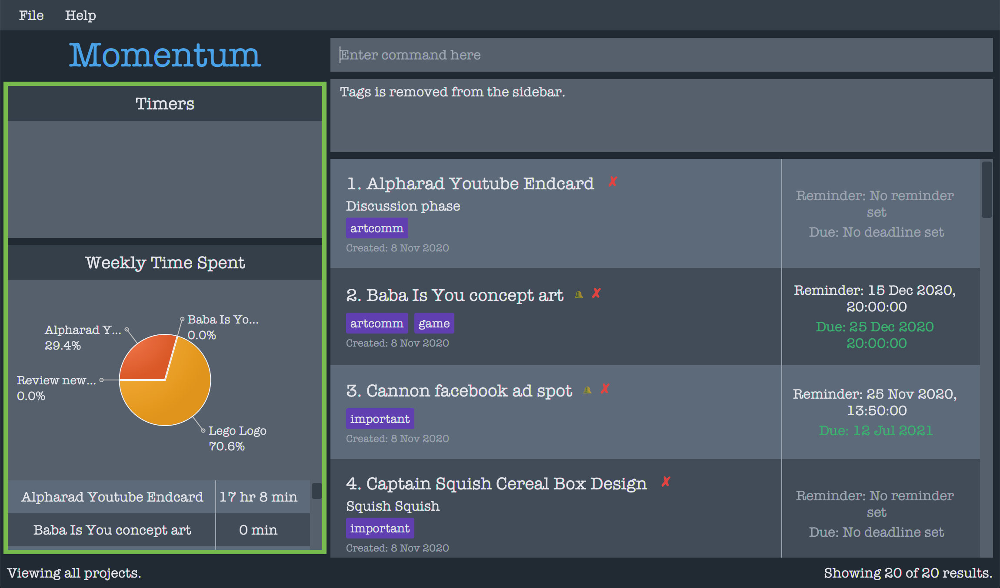

### 5.5. Undoing/Redoing

Done By Kang Su Min

Momentum allows you to easily reverse any mistakes that you make with the `undo` and `redo` commands.

#### 5.5.1. Undoing the Previous Command: `undo`

The undo command reverses the previous command that you executed. This allows you to revert changes that you have made to Momentum.

Format: `undo`

The following walkthrough shows how you can start a timer for a project, then undo the command.

1. Key in command `start 1` in the command box then press <kbd>Enter</kbd>.

   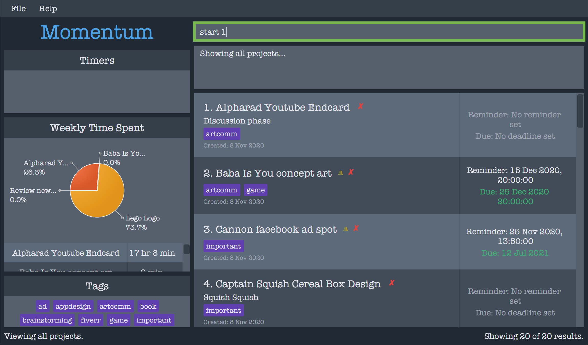

2. The result box will display a message to indicate that the command has been executed successfully, and the timer for that project will appear at the side panel.

   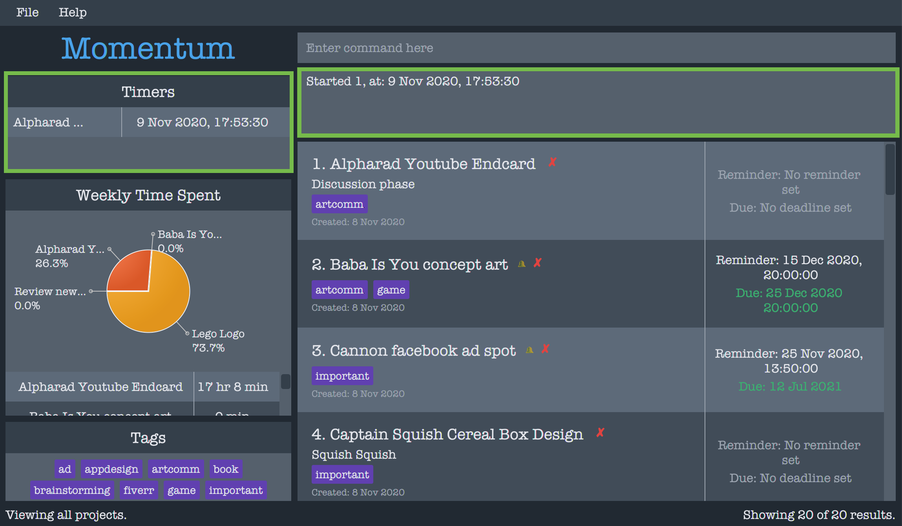

3. Key in command `undo` in the command box then press <kbd>Enter</kbd>.

   

4. The result box will display a message to indicate that the command has been undone successfully.

   

5. The timer has been stopped for the project. The time tracked is not saved.

   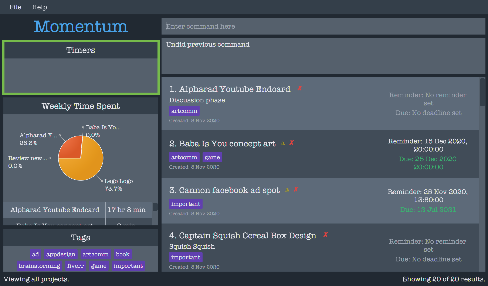

#### 5.5.2. Redoing the Previous Command: `redo`

The redo command reverses the previous undo command that you executed. This allows you to revert the changes made by an undo command.

Format: `redo`

The following walkthough uses a change in [sort type](#516-sorting-projectstasks--sort) to show how you can redo the changes made by an undo command.

1. Key in command `sort type/deadline` in the command box then press <kbd>Enter</kbd>.

   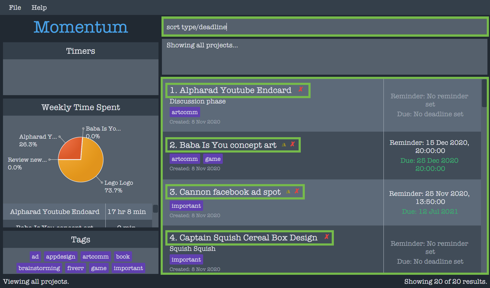

   Note: The projects are currently sorted in alphabetical, ascending order (default order).

2. The result box will display a message to indicate that the command has been executed successfully. Projects are now sorted in ascending deadline order.

   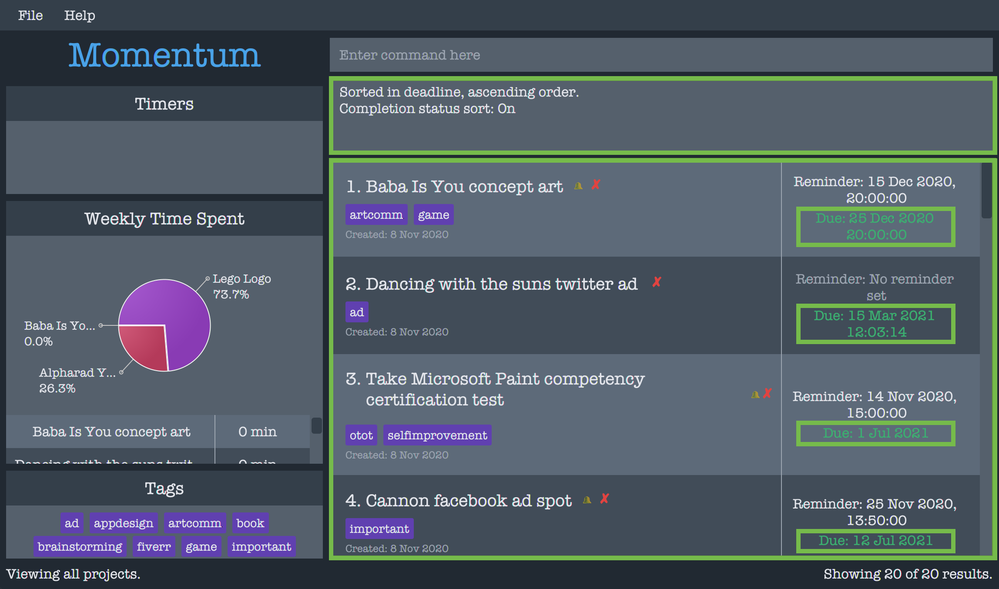

3. Key in command `undo` in the command box then press <kbd>Enter</kbd>.

  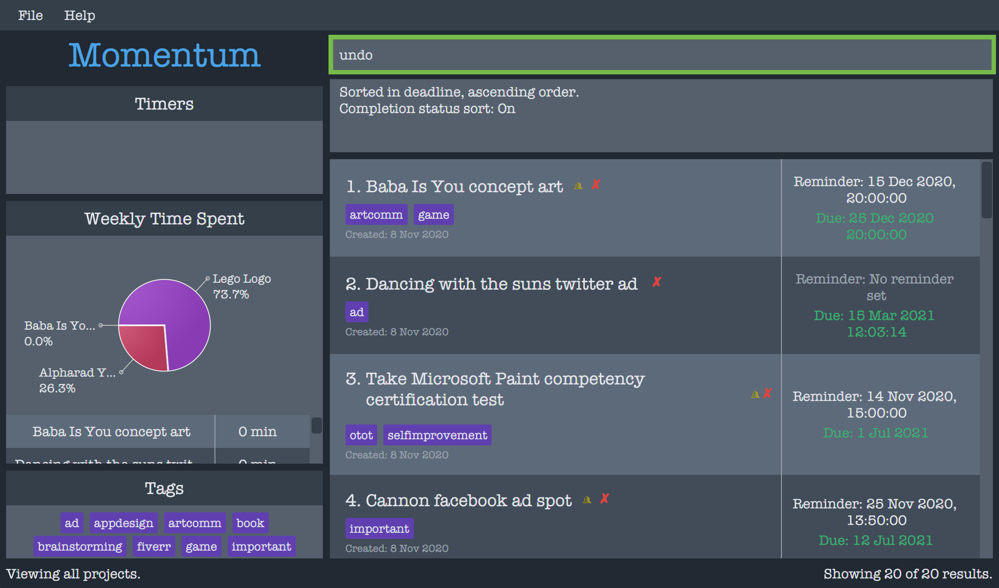

4. The result box will display a message to indicate that the command has been undone successfully. Projects are now sorted in their original order (alphabetical, ascending).

   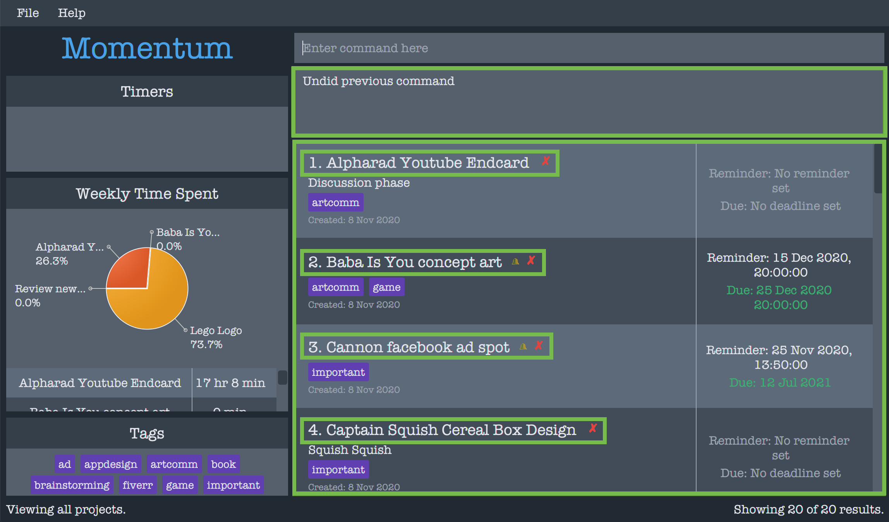

5. Key in command `redo` in the command box then press <kbd>Enter</kbd>.

   

6. The result box will display a message to indicate that the command has been redone successfully.

   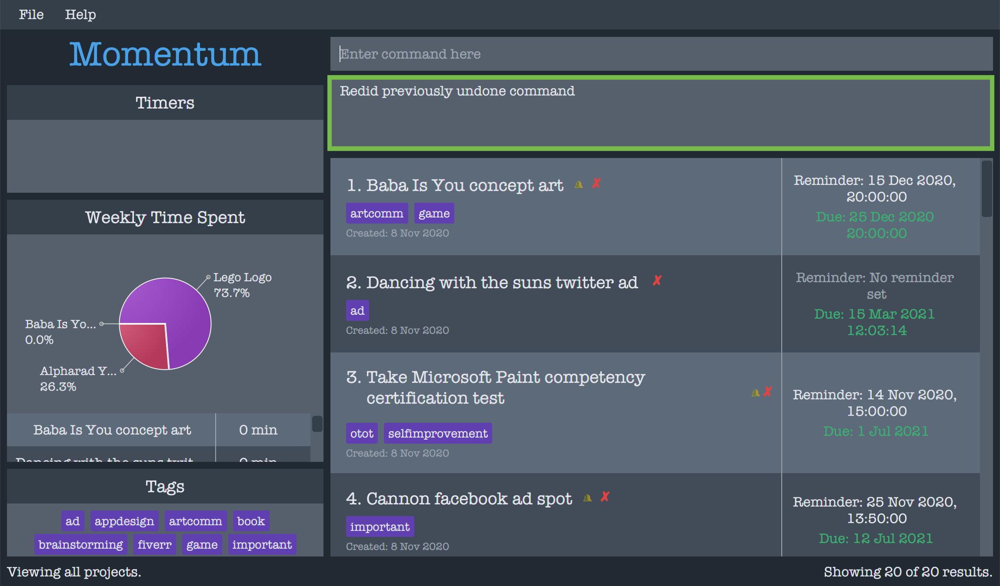

7. Projects are again sorted in ascending deadline order.

   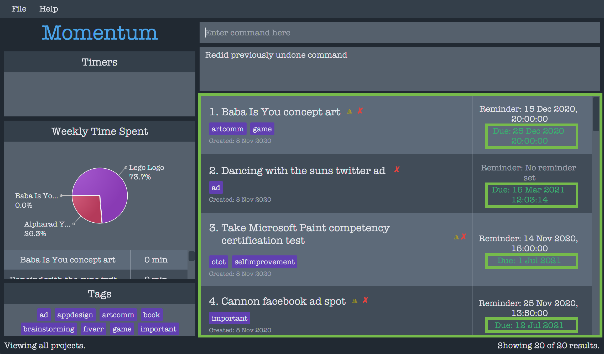

:bulb: Here are some things to take note of:

* Undo/redo will not work on the `help` or `exit` command.

* Redo command only works if the previous command is `undo`.

### 5.6. Statistics

Done by Farrell Nah Jun Hao

Momentum uses the data collected from your [timers](#52-time-tracking) to calculate statistics. These statistics are automatically generated and updated whenever you make any changes to your items, such as when you start or stop a new timer. They can be seen in a panel on the left side of the window, as shown here:

Figure 5.6A: Location of the statistics panel

The order of the statistics displayed correspond to the items currently shown in the displayed list, and will automatically change when the items in the displayed list changes (such as when you [find specific items](#517-searching-for-projectstasks-find) or [sort the list of items](#516-sorting-projectstasks--sort)).

Figure 5.6B: The order of the statistics entries matches the order in the displayed list.

You do not need to use any additional commands to update or view the statistics.

#### 5.6.1 Timeframes

Momentum only tracks your statistics within a particular timeframe. You can change the timeframe through the [settings](#57-settings).

Momentum allows you to track the time spent within these timeframes:

* Daily
* Weekly
* Monthly

By default, the timeframe will be set to weekly.

Here are the statistics being tracked by Momentum:

#### 5.6.2. Time Spent per Project/Task

This statistic tells you the total amount of time you have spent within the timeframe. For projects, this includes all the time you have spent on each individual task, as well as on the project as a whole.

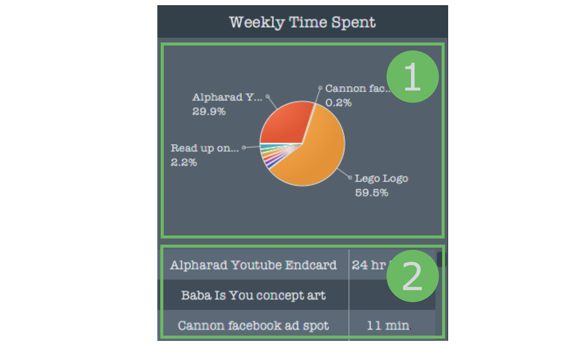
Figure 5.6.2A: Sections of the statistics panel.

The statistics are displayed in 2 different formats:

1. **Pie Chart**: Shows the relative time spent on each item. Useful for comparing different items. Items with less time spent on them may not be shown.

2. **Table**: Shows the exact (in minutes) amount of time spent on each item. Useful for calculations.

### 5.7. Settings

Done by Khoo De Hui

Momentum allows you to change various settings so that you can make the application more suited to your preferences. Currently, the settings which you can adjust are:
* The application [theme](#42-user-interface-theme).

* The [timeframe](#561-timeframes) of the statistics shown.

Format: `set [th/THEME] [st/TIMEFRAME]`

* At least one of the optional fields must be provided.

* There are two GUI themes available, Light and Dark. The parameters to apply them are:
  * `th/light`
  * `th/dark`

* There are three available timeframes for statistics, daily, weekly and monthly. The parameters to apply them are:
  * `st/daily`
  * `st/weekly`
  * `st/monthly`

The following walkthrough shows how you can change the theme and settings timeframe.

1. In order to set your GUI theme to light and your statistic timeframe to monthly, type `set th/light th/monthly` in the command box and press the <kbd>Enter</kbd> key to execute it.

   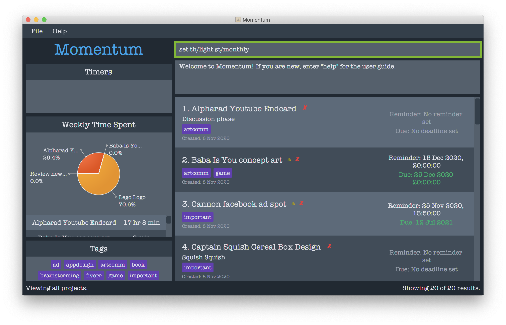

2. The result box will display a message to indicate that your command has been executed successfully.

   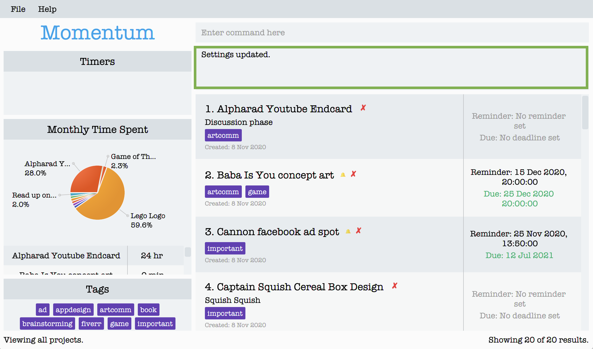

3. Your GUI has now been set to the light theme, and information in your statistics panel has been updated.

   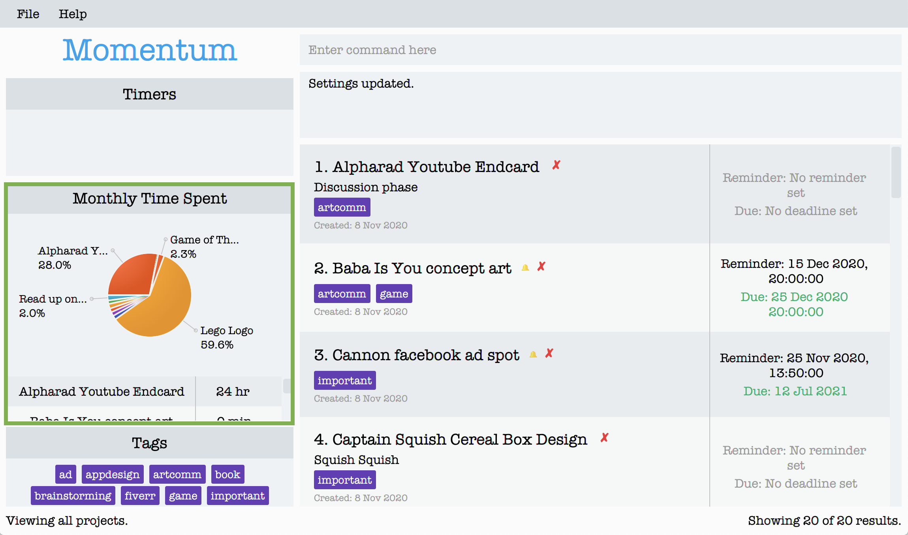

### 5.8. Clearing All Projects/Tasks : `clear`

Done by Farrell Nah Jun Hao

When you are viewing all projects, this command deletes all the projects in Momentum, including their tasks.

When you are viewing a specific project's tasks, this command will delete all the tasks in the project. The project itself will not be deleted.

:warning:
This command will also delete the saved data.
You can undo this operation while Momentum remains open.
However, you will not be able to undo this once you close Momentum.

Please be careful when using this command, as you may loose large amounts of your data.

Format: `clear`

The following walkthrough shows how you can clear all projects in Momentum

1. Ensure that you are viewing all projects.

    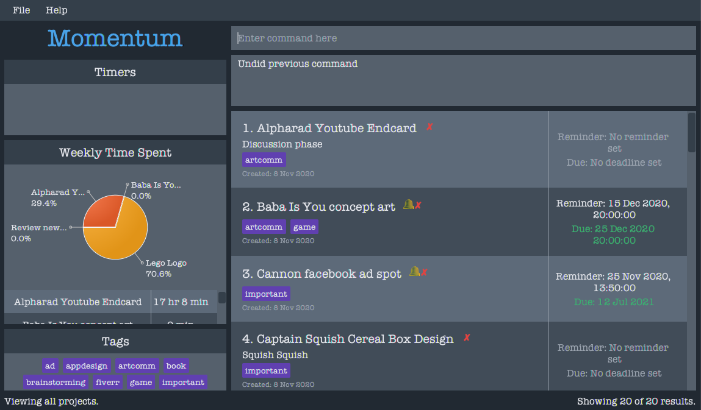
    
2. Type `clear` into the command box and press <kbd>Enter</kbd>.
    
    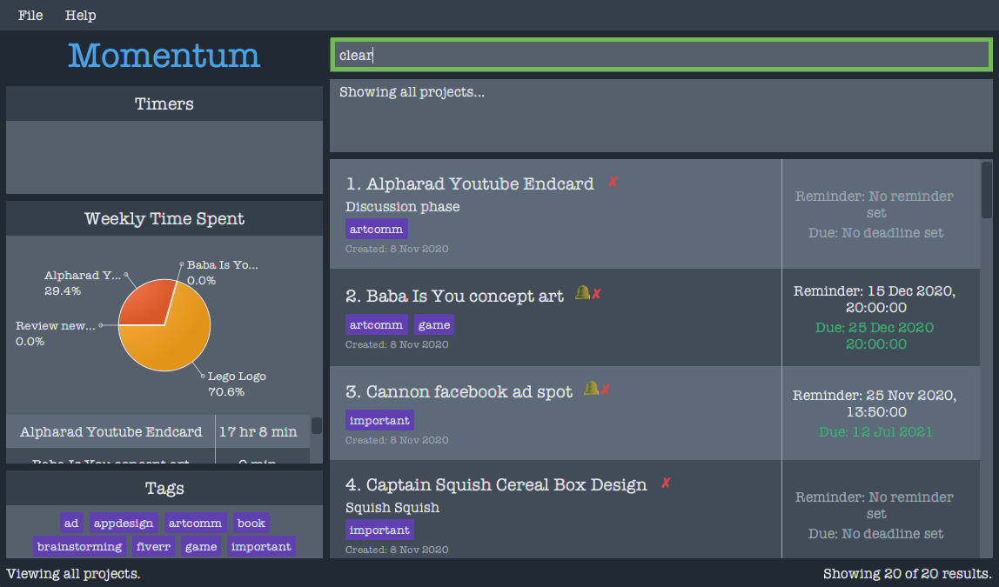

3. The result box will display a message to indicate that all projects have been cleared. You should no long see any projects in the displayed list.

    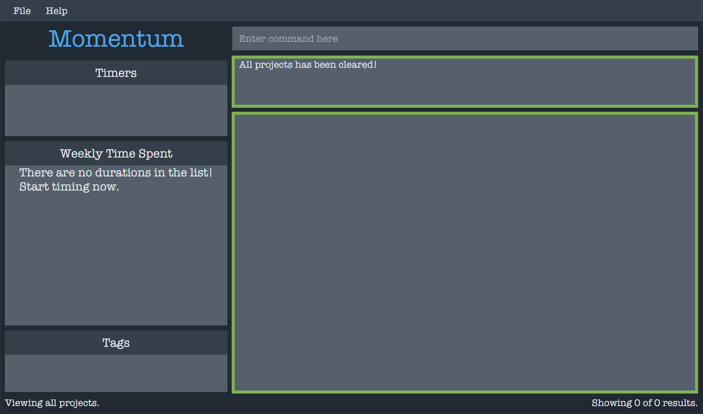

### 5.9. Viewing Help : `help`

Shows a message explaining how to access the help page.

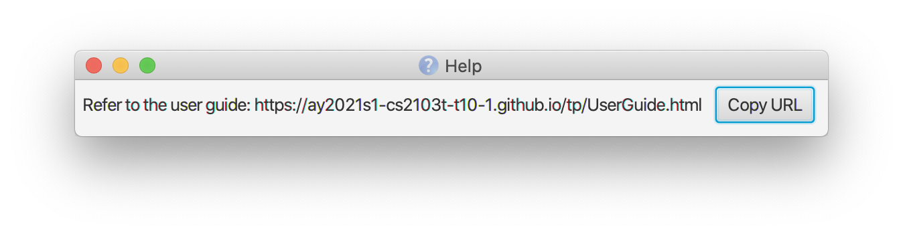
Figure 5.9A: The help window.

Format: `help`

### 5.10. Exiting the Program : `exit`

All project, task and timer information are saved automatically after every command. There is no need to save manually.

You can find the saved data in the following file in the same location where Momentum is located: `data/projectbook.json`

Format: `exit`

Result: Exits the program.

--------------------------------------------------------------------------------------------------------------------

## 6. FAQ

**Q**: How do I transfer my data to another Computer?  
**A**: Install the app in the other computer and overwrite the empty data file it creates with the file that contains the data of your previous Momentum home folder.

**Q**: Momentum is showing "Dates and Times should be in ISO8601 format. e.g. 2020-09-23T16:55:12". Whats wrong?  
**A**: You have entered a date and/or time in the wrong format. Please refer to the [date and time terms](#23-date-and-time-terms) for the correct format to use.

**Q**: Momentum is showing "Unknown Command". Whats wrong?  
**A**: You have entered a command that is not recognised by Momentum. Please refer to the [command summary](#8-command-summary) for a list of commands that you can enter into Momentum.

--------------------------------------------------------------------------------------------------------------------

## 7. Glossary

* **Command Line Interface(CLI)**: Command Line Interface processes commands in the form of text.

* **Project View**: View all projects in the project book.

* **Task View**: View all tasks that are added to a single project.

* **Theme**: Colour scheme of the application.

* **Window**: The area of your computer's screen that displays the [user interface](#4-user-interface-overview) of Momentum.

--------------------------------------------------------------------------------------------------------------------

## 8. Command Summary

Action | Format | Example
--------|-------|-----------
**Clearing all Items** | `clear` | -
**Creating an Item** | `add n/NAME [d/DESCRIPTION] [c/] [dd/DEADLINE_DATE [dt/DEADLINE_TIME]] [r/REMINDER_DATE_TIME] [t/TAG]​`|  `project n/Momentum d/CS2103T Team Project dd/2021-12-07 t/impt`
**Deleting an Item** | `delete ID` | `delete 3`
**Dismissing a Reminder** | `dismiss` | -
**Editing an Item** | `edit ID [n/NAME] [d/DESCRIPTION] [c/]  [dd/DEADLINE_DATE [dt/DEADLINE_TIME]] [r/REMINDER_DATE_TIME] [t/TAG]`| `edit 3 n/NewMomentum d/NewDescription dd/2021-12-07 r/2021-12-07T01:21:21 t/normal`
**Exiting** | `exit` | -
**Help** | `help` | -
**Redoing** | `redo` | -
**Searching for an Item** | `find [match/FILTER_TYPE] [n/NAME [MORE_NAMES]...] [d/DESCRIPTION [MORE_DESCRIPTIONS]...] [t/TAG [MORE_TAGS]...]  [c/COMPLETION_STATUS]`  | `find match/any n/Momentum d/new t/normal`
**Settings** | `set [th/THEME] [st/TIMEFRAME]` | `set th/dark st/daily`
**Showing all Items (after find)** | `list` | -
**Showing and Hiding Tags** | `show t/` | -
**Sorting Items** | `sort [type/SORT_TYPE] [order/SORT_ORDER] [c/]` | `sort type/deadline order/dsc c/`
**Starting Timers** | `start ID` | `start 2`
**Stopping Timers** | `stop ID` | `stop 2`
**Undoing** | `undo` | -
**Viewing all Projects**| `home` | -
**Viewing Tasks in a Project**| `view ID` |`view 3`
